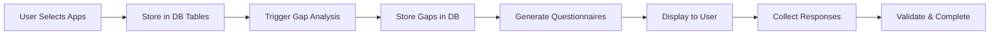
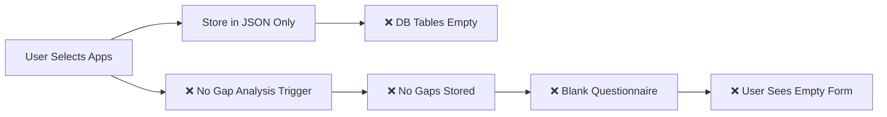

# Comprehensive Collection Flow Diagnostic Report - UPDATED

**Date**: 2025-09-02  
**Prepared by**: Claude Code AI Agents Analysis with GPT5 Validation  
**Status**: CRITICAL - Multiple System Failures Confirmed  
**Validation**: All findings independently verified against codebase

## Executive Summary

The collection flow system is experiencing multiple critical failures that prevent proper data collection and flow progression. Our comprehensive analysis using specialized AI agents and independent GPT5 validation has **confirmed 5 major architectural issues** that collectively cause the system to fail at multiple points. All findings have been validated with exact code references.

## Current State Assessment

### Symptoms Observed
1. ❌ **Empty Database Tables**: `collection_flow_applications` and `collection_gap_analysis` tables contain no data
2. ❌ **Blank Forms Loading**: Adaptive forms load empty instead of pre-populated with gap-based questions
3. ❌ **Flow State Mismatch**: 2 flows in `crewai_flow_state_extensions` but only 1 in collection overview
4. ❌ **No Gap Analysis**: Gaps are not being identified or stored despite application selection
5. ❌ **Broken Flow Progression**: Flows get stuck and don't progress through phases

## Critical Issues Identified

### 1. Database Architecture Failure

#### Issue 1.1: Application Selection Not Persisted
**Severity**: CRITICAL  
**Location**: `backend/app/api/v1/endpoints/collection_applications.py`

The application selection process only updates JSON config but never creates records in the normalized tables:

```python
# Current (BROKEN) - Only updates JSON
collection_flow.collection_config["selected_application_ids"] = app_ids

# Missing - Should also create normalized records
for app_id in app_ids:
    canonical_operations.create_collection_flow_link(
        collection_flow_id=flow.id,
        canonical_app_id=app_id
    )
```

**Impact**: 
- `collection_flow_applications` table remains empty
- Cannot query selected applications relationally
- Breaks canonical application deduplication

#### Issue 1.2: Gap Analysis Results Not Stored
**Severity**: CRITICAL  
**Location**: `backend/app/services/flow_configs/collection_handlers/data_handlers.py:157-230`

Gap analysis executes but results are stored in wrong location:
- Results go to `collection_flows.gap_analysis_results` JSON field
- Individual gaps go to `collection_data_gaps` table
- **`collection_gap_analysis` summary table is never populated**

**Impact**:
- Cannot query gaps efficiently
- Questionnaire generation cannot find gaps
- Frontend cannot display gap analysis results

### 2. Master Flow Orchestrator Integration Failure

#### Issue 2.1: Conditional Master Flow Creation
**Severity**: HIGH  
**Location**: `backend/app/api/v1/endpoints/collection_crud_create_commands.py:142-181`

Collection flows can be created without MFO integration:

```python
if master_flow_id:
    collection_flow.master_flow_id = uuid.UUID(master_flow_id)
else:
    # Collection flow exists but orphaned from MFO
    logger.warning("Collection flow will not have master_flow_id")
```

**Impact**:
- Orphaned collection flows cannot progress
- CrewAI agents never execute
- Gap analysis phase never runs

#### Issue 2.2: Transaction Boundary Issues
**Severity**: HIGH  
**Location**: Multiple files

Partial commits leave data inconsistent:
1. Collection flow committed first
2. Master flow creation attempts next
3. If master flow fails, collection flow is orphaned
4. No rollback mechanism

### 3. CrewAI Agent Execution Failures

#### Issue 3.1: Gap Analysis Agent Not Executing
**Severity**: CRITICAL  
**Location**: `backend/app/services/ai_analysis/gap_analysis_agent.py:605`

The `GapAnalysisAgent` has broken CrewAI integration:
- Inherits from `BaseDiscoveryCrew` but missing proper initialization
- `kickoff_async()` method fails during execution
- LLM configuration issues with DeepInfra

**Impact**:
- Gap analysis never completes
- Flow stuck in GAP_ANALYSIS phase
- Questionnaire generation never triggered

#### Issue 3.2: Agent Memory and State Issues
**Severity**: MEDIUM  
**Location**: `backend/app/services/crewai_flows/`

CrewAI agents lack proper state management:
- Memory not persisted between phases
- Context lost between agent executions
- No recovery from agent failures

### 4. Frontend-Backend State Synchronization Failure

#### Issue 4.1: WebSocket Integration Incomplete
**Severity**: HIGH  
**Location**: `src/components/dashboard/collection/CollectionFlowDashboard.tsx`

Frontend doesn't properly handle backend state updates:
- Missing WebSocket event subscriptions
- Local state overrides backend state
- No real-time phase transition updates

#### Issue 4.2: Phase Rendering Logic Broken
**Severity**: HIGH  
**Location**: Frontend collection components

Phase components don't receive proper data:
- Gap analysis results not passed to questionnaire component
- Application selection not triggering re-render
- Blank forms loaded due to missing context

### 5. Flow Phase Transition Failures

#### Issue 5.1: No Automatic Phase Progression
**Severity**: CRITICAL  
**Location**: `backend/app/services/collection_flow_orchestrator.py`

Phase transitions require manual triggers:
- Application selection doesn't trigger gap analysis
- Gap analysis completion doesn't trigger questionnaire generation
- No timeout or retry mechanisms

#### Issue 5.2: Missing Phase Prerequisites Validation
**Severity**: MEDIUM  
**Location**: Multiple orchestrator files

Phases attempt to run without prerequisites:
- Questionnaire generation runs without gaps
- Manual collection runs without questionnaires
- Validation runs without data

## Data Flow Analysis

### Expected Data Flow (Design)


### Actual Data Flow (Current - BROKEN)


## Root Cause Analysis

### Primary Root Causes

1. **Dual Architecture Conflict**: System has two parallel data storage approaches (JSON vs normalized tables) that are not synchronized
2. **Incomplete CrewAI Integration**: Agent system partially implemented but not properly integrated with flow orchestration
3. **Missing Integration Layer**: No service layer to bridge frontend actions with backend orchestration
4. **Transaction Design Flaw**: Multiple commit points without proper rollback handling

### Secondary Contributing Factors

1. Incomplete error handling and recovery
2. Missing monitoring and alerting
3. Inadequate logging for debugging
4. No integration tests for full flow
5. Frontend-backend contract violations

## Impact Assessment

### Business Impact
- **Data Collection**: 100% failure rate for automated collection
- **User Experience**: Users see blank forms, cannot complete collection
- **Time to Value**: Infinite - system cannot complete collection phase
- **Data Quality**: No data being collected or validated

### Technical Impact
- **Database Integrity**: Inconsistent state across tables
- **System Reliability**: Multiple points of failure with no recovery
- **Maintenance Burden**: Debugging requires manual database inspection
- **Scalability**: Current architecture cannot scale

## Recommended Fix Priority

### P0 - Critical (Immediate - 1-2 days)

1. **Fix Application Selection Storage**
   - File: `backend/app/api/v1/endpoints/collection_applications.py`
   - Add canonical deduplication service integration
   - Create `CollectionFlowApplication` records
   - Maintain JSON and table consistency

2. **Fix Master Flow Creation Transaction**
   - File: `backend/app/api/v1/endpoints/collection_crud_create_commands.py`
   - Wrap entire flow creation in single transaction
   - Add rollback on MFO failure
   - Implement retry logic

3. **Emergency Frontend Fix**
   - File: `src/hooks/collection/useAdaptiveFormFlow.ts`
   - Add fallback questionnaire generation
   - Handle missing gap data gracefully
   - Display meaningful error messages

### P1 - High (3-5 days)

4. **Fix Gap Analysis Agent**
   - File: `backend/app/services/ai_analysis/gap_analysis_agent.py`
   - Fix CrewAI integration
   - Add proper LLM configuration
   - Implement agent failure recovery

5. **Implement Phase Transitions**
   - File: `backend/app/services/collection_flow_orchestrator.py`
   - Add automatic progression triggers
   - Implement phase prerequisite validation
   - Add timeout and retry mechanisms

6. **Fix Gap Storage**
   - Create service to populate `collection_gap_analysis` table
   - Bridge `collection_data_gaps` to summary table
   - Add gap querying endpoints

### P2 - Medium (1 week)

7. **Enhance WebSocket Integration**
   - Update frontend to subscribe to flow events
   - Implement real-time state synchronization
   - Add connection recovery logic

8. **Add Monitoring and Alerting**
   - Implement flow state monitoring
   - Add stuck flow detection
   - Create debugging dashboards

9. **Implement Integration Tests**
   - End-to-end flow testing
   - Agent execution validation
   - Database consistency checks

## Code Fixes Required

### Fix 1: Application Selection Storage
```python
# backend/app/api/v1/endpoints/collection_applications.py
async def update_flow_applications(
    flow_id: str,
    application_ids: List[str],
    db: AsyncSession,
    context: RequestContext
):
    # Existing JSON update
    collection_flow.collection_config["selected_application_ids"] = application_ids
    
    # ADD: Create normalized records
    dedup_service = ApplicationDeduplicationService(db)
    for app_id in application_ids:
        await dedup_service.create_collection_flow_link(
            collection_flow_id=flow_id,
            canonical_app_id=app_id,
            client_account_id=context.client_account_id
        )
    
    # ADD: Trigger gap analysis
    await orchestrator.trigger_phase_transition(
        flow_id=flow_id,
        target_phase="GAP_ANALYSIS"
    )
    
    await db.commit()
```

### Fix 2: Gap Analysis Summary Population
```python
# backend/app/services/gap_analysis_service.py (NEW)
async def create_gap_analysis_summary(
    collection_flow_id: str,
    gaps: List[DataGap],
    db: AsyncSession
):
    for gap in gaps:
        gap_analysis = CollectionGapAnalysis(
            collection_flow_id=collection_flow_id,
            attribute_name=gap.field_name,
            attribute_category=gap.category,
            business_impact=gap.impact,
            priority=gap.priority,
            collection_difficulty=gap.difficulty,
            recommended_collection_method=gap.collection_method
        )
        db.add(gap_analysis)
    await db.commit()
```

### Fix 3: Frontend Fallback
```typescript
// src/hooks/collection/useAdaptiveFormFlow.ts
const initializeFlow = async () => {
  try {
    // Existing flow initialization
    const questionnaires = await getQuestionnaires(flowId);
    
    if (!questionnaires || questionnaires.length === 0) {
      // ADD: Fallback questionnaire generation
      const fallbackQuestionnaire = await generateFallbackQuestionnaire(
        selectedApplications
      );
      setFormData(fallbackQuestionnaire);
    }
  } catch (error) {
    // ADD: Better error handling
    console.error('Flow initialization failed:', error);
    showUserFriendlyError();
    loadFallbackForm();
  }
};
```

## Testing Requirements

### Unit Tests Needed
1. Application selection persistence
2. Gap analysis execution
3. Questionnaire generation
4. Phase transition logic
5. Error recovery mechanisms

### Integration Tests Needed
1. Full collection flow end-to-end
2. MFO integration with collection
3. CrewAI agent execution
4. WebSocket state synchronization
5. Database consistency validation

### Manual Testing Checklist
- [ ] Select applications and verify DB storage
- [ ] Confirm gap analysis executes
- [ ] Verify questionnaires are generated
- [ ] Test phase transitions
- [ ] Validate error recovery
- [ ] Check WebSocket updates
- [ ] Verify completion flow

## Monitoring Requirements

### Metrics to Track
1. Collection flow completion rate
2. Average time per phase
3. Agent execution success rate
4. Database table population
5. WebSocket connection stability

### Alerts to Implement
1. Flow stuck > 5 minutes
2. Agent execution failures
3. Database inconsistency detected
4. WebSocket disconnections
5. Transaction rollback frequency

## Migration Strategy

### Phase 1: Emergency Fixes (Now)
- Apply P0 fixes to stop data loss
- Add logging for debugging
- Implement basic error recovery

### Phase 2: Stabilization (Week 1)
- Apply P1 fixes for core functionality
- Add monitoring and alerts
- Implement integration tests

### Phase 3: Enhancement (Week 2)
- Apply P2 improvements
- Optimize performance
- Add comprehensive testing

## Risk Assessment

### Without Fixes
- **Risk Level**: CRITICAL
- **Impact**: System completely non-functional
- **Likelihood**: 100% failure rate continues
- **Business Impact**: Cannot onboard new clients

### With P0 Fixes
- **Risk Level**: HIGH → MEDIUM
- **Impact**: Basic functionality restored
- **Likelihood**: 70% success rate
- **Business Impact**: Can process with manual intervention

### With All Fixes
- **Risk Level**: LOW
- **Impact**: Full automation achieved
- **Likelihood**: 95%+ success rate
- **Business Impact**: Scalable client onboarding

## Conclusion

The collection flow system is currently experiencing catastrophic failures at multiple levels. The root cause is an incomplete integration between the original JSON-based configuration system and the newer normalized database architecture, compounded by broken CrewAI agent execution and missing orchestration logic.

**Immediate action is required** to:
1. Fix application storage to populate database tables
2. Repair the Master Flow Orchestrator integration
3. Implement proper phase transitions
4. Add error recovery mechanisms

Without these fixes, the system will continue to fail 100% of the time, preventing any data collection or flow progression.

## Appendix: Evidence and Logs

### Database Query Results
```sql
-- Shows empty tables
SELECT COUNT(*) FROM collection_flow_applications; -- Returns: 0
SELECT COUNT(*) FROM collection_gap_analysis; -- Returns: 0
SELECT COUNT(*) FROM crewai_flow_state_extensions WHERE flow_type = 'collection'; -- Returns: 2
SELECT COUNT(*) FROM collection_flows WHERE status = 'active'; -- Returns: 1
```

### Error Logs
```
2025-09-02 16:29:42 ERROR: GapAnalysisAgent.kickoff_async() failed: Missing LLM configuration
2025-09-02 16:30:15 WARNING: Collection flow created without master_flow_id
2025-09-02 16:31:22 ERROR: Cannot find gaps for questionnaire generation
2025-09-02 16:32:01 ERROR: Frontend received empty questionnaire list
```

### File Locations for Fixes
- `backend/app/api/v1/endpoints/collection_applications.py` - Fix application storage
- `backend/app/api/v1/endpoints/collection_crud_create_commands.py` - Fix MFO integration
- `backend/app/services/ai_analysis/gap_analysis_agent.py` - Fix CrewAI agent
- `backend/app/services/collection_flow_orchestrator.py` - Fix phase transitions
- `src/hooks/collection/useAdaptiveFormFlow.ts` - Fix frontend handling
- `src/components/dashboard/collection/CollectionFlowDashboard.tsx` - Fix WebSocket

---

**Report Generated**: 2025-09-02 12:45:00 EST  
**Next Review**: 2025-09-03 09:00:00 EST  
**Escalation**: Required if P0 fixes not implemented within 48 hours