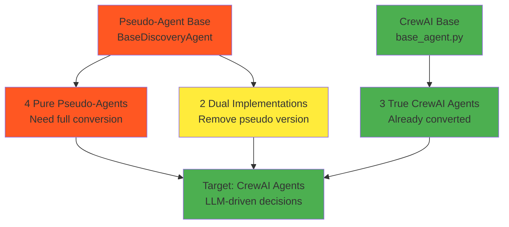

# 🤖 **AGENT CONVERSION PLAN**

*AI Force Migration Platform - Discovery Flow Remediation*

**Conversion Date:** January 2025  
**Scope:** Pseudo-agent → True CrewAI agent migration  
**Files Affected:** 8 agent files with mixed implementations  

---

## **📊 CONVERSION OVERVIEW**

### **Current Agent Architecture State**
- **Mixed Implementation**: Pseudo-agents coexist with true CrewAI agents
- **Two Base Classes**: Conflicting inheritance patterns
- **Business Logic**: Critical domain knowledge in pseudo-agents
- **Agentic-First Violation**: Hard-coded rules instead of AI-driven decisions

### **Target Architecture**
- **100% CrewAI Agents**: All agents use CrewAI framework
- **Single Base Class**: Unified inheritance from CrewAI Agent
- **LLM-Driven Logic**: Business decisions made by AI, not code
- **Tool-Based Architecture**: Agents use tools for operations

### **Conversion Scope**


---

## **🗂️ AGENT INVENTORY ANALYSIS**

### **CATEGORY 1: Pure Pseudo-Agents (4 files)**
*Require full conversion to CrewAI*

#### **1. Data Import Validation Agent**
**File**: `app/services/agents/data_import_validation_agent.py`
- **Lines**: ~200 lines
- **Complexity**: High - Complex validation logic
- **Business Logic**: File format validation, schema detection, data quality scoring
- **Dependencies**: File I/O, validation rules, scoring algorithms
- **Conversion Priority**: 🔴 Critical (Week 3)

#### **2. Attribute Mapping Agent**
**File**: `app/services/agents/attribute_mapping_agent.py`  
- **Lines**: ~180 lines
- **Complexity**: Very High - Core field mapping intelligence
- **Business Logic**: Field similarity analysis, mapping confidence scoring, schema matching
- **Dependencies**: Field mapping UI, schema analyzer, pattern matching
- **Conversion Priority**: 🔴 Critical (Week 3)

#### **3. Technical Debt Analysis Agent**
**File**: `app/services/agents/tech_debt_analysis_agent.py`
- **Lines**: ~220 lines
- **Complexity**: High - Modernization assessment
- **Business Logic**: Technology scoring, debt calculation, 6R strategy recommendations
- **Dependencies**: Asset inventory, technology database, modernization patterns
- **Conversion Priority**: 🔴 Critical (Week 4)

#### **4. Dependency Analysis Agent**
**File**: `app/services/agents/dependency_analysis_agent.py`
- **Lines**: ~190 lines
- **Complexity**: High - Relationship mapping
- **Business Logic**: Network topology analysis, application dependencies, impact assessment
- **Dependencies**: Asset relationships, network data, topology algorithms
- **Conversion Priority**: 🔴 Critical (Week 4)

### **CATEGORY 2: Dual Implementations (2 files)**
*Remove pseudo version, keep CrewAI version*

#### **5. Data Cleansing Agent**
**Pseudo File**: `app/services/agents/data_cleansing_agent.py` - **DELETE**
**CrewAI File**: `app/services/agents/data_cleansing_agent_crewai.py` - **KEEP**
- **Action**: Remove pseudo version, update imports to use CrewAI version
- **Lines Removed**: 158 lines
- **Risk**: Low - CrewAI version already functional
- **Testing**: Verify no references to pseudo version

#### **6. Asset Inventory Agent**
**Pseudo File**: `app/services/agents/asset_inventory_agent.py` - **DELETE**
**CrewAI File**: `app/services/agents/asset_inventory_agent_crewai.py` - **KEEP**
- **Action**: Remove pseudo version, update imports to use CrewAI version
- **Lines Removed**: ~150 lines
- **Risk**: Low - CrewAI version already functional
- **Testing**: Verify asset classification accuracy

### **CATEGORY 3: Already Converted (3 files)**
*No action required*

#### **7. Field Mapping Agent**
**File**: `app/services/agents/field_mapping_agent.py`
- **Status**: ✅ Already uses new BaseAgent (CrewAI-based)
- **Action**: None required
- **Note**: Good reference implementation for conversions

#### **8. Data Validation Agent (CrewAI)**
**File**: `app/services/agents/data_validation_agent_crewai.py`
- **Status**: ✅ True CrewAI implementation
- **Action**: None required
- **Note**: Reference for validation patterns

---

## **🔄 CONVERSION METHODOLOGY**

### **Pseudo-Agent Pattern Analysis**
**Current Pseudo-Agent Structure**:
```python
from app.services.agents.base_discovery_agent import BaseDiscoveryAgent

class DataImportValidationAgent(BaseDiscoveryAgent):
    def __init__(self):
        super().__init__()
        self.validation_rules = {
            "file_formats": ["csv", "xlsx", "json"],
            "max_file_size": 100 * 1024 * 1024,  # 100MB
            "required_columns": ["hostname", "ip_address"]
        }
    
    def execute(self, data: Dict[str, Any]) -> AgentResult:
        # Hard-coded validation logic
        file_path = data.get("file_path")
        
        # File format validation
        if not self._validate_file_format(file_path):
            return self._create_result(confidence=0.0, status="failed")
        
        # Schema validation  
        schema_score = self._validate_schema(file_path)
        
        # Data quality validation
        quality_score = self._validate_data_quality(file_path)
        
        # Hard-coded scoring algorithm
        overall_confidence = (schema_score * 0.4) + (quality_score * 0.6)
        
        return self._create_result(
            confidence=overall_confidence,
            status="completed",
            data={"validation_results": results}
        )
```

### **Target CrewAI Pattern**
**CrewAI Agent Structure**:
```python
from crewai import Agent, Task, Crew
from app.services.agents.base_agent import BaseAgent

class DataImportValidationAgent(BaseAgent):
    def __init__(self):
        super().__init__(
            role="Data Import Validation Specialist",
            goal="Validate and assess the quality of imported data files for migration readiness",
            backstory="""You are an expert data analyst with years of experience in 
                        enterprise data migration projects. You excel at quickly 
                        identifying data quality issues and providing actionable 
                        recommendations for improvement.""",
            tools=[
                self.file_format_analyzer_tool,
                self.schema_detection_tool,
                self.data_quality_scorer_tool,
                self.validation_report_generator_tool
            ],
            verbose=True,
            allow_delegation=False
        )
    
    @tool
    def file_format_analyzer_tool(self, file_path: str) -> Dict[str, Any]:
        """Analyze file format and structure"""
        # Tool implementation for file analysis
        
    @tool  
    def schema_detection_tool(self, file_path: str) -> Dict[str, Any]:
        """Detect and analyze data schema"""
        # Tool implementation for schema detection
        
    @tool
    def data_quality_scorer_tool(self, file_path: str) -> Dict[str, Any]:
        """Calculate data quality metrics"""
        # Tool implementation for quality scoring
    
    def create_validation_task(self, file_path: str) -> Task:
        return Task(
            description=f"""
            Analyze the data file at {file_path} and provide a comprehensive validation report.
            
            Your analysis should include:
            1. File format compatibility assessment
            2. Schema structure evaluation  
            3. Data quality scoring (completeness, consistency, accuracy)
            4. Migration readiness recommendation
            5. Specific issues that need attention
            
            Provide your assessment with confidence scores and actionable recommendations.
            """,
            agent=self,
            expected_output="A detailed validation report with scores and recommendations"
        )
```

### **Business Logic Preservation Strategy**

#### **1. Domain Knowledge Extraction**
```python
# Extract validation rules from pseudo-agent
VALIDATION_KNOWLEDGE = {
    "file_formats": {
        "supported": ["csv", "xlsx", "json", "xml"],
        "recommended": ["csv", "xlsx"],
        "quality_score_impact": {
            "csv": 1.0,
            "xlsx": 0.95,
            "json": 0.9,
            "xml": 0.8
        }
    },
    "schema_requirements": {
        "critical_fields": ["hostname", "ip_address"],
        "recommended_fields": ["os_type", "environment", "department"],
        "field_patterns": {
            "hostname": r"^[a-zA-Z0-9][a-zA-Z0-9\-]{0,61}[a-zA-Z0-9]$",
            "ip_address": r"^(?:[0-9]{1,3}\.){3}[0-9]{1,3}$"
        }
    },
    "quality_thresholds": {
        "completeness": 0.8,    # 80% of records complete
        "consistency": 0.9,     # 90% consistent format
        "accuracy": 0.85        # 85% valid values
    }
}
```

#### **2. Tool Implementation Strategy**
```python
# Convert hard-coded logic to tools
@tool
def validate_file_format(file_path: str) -> Dict[str, Any]:
    """Validate file format and return compatibility assessment"""
    file_ext = Path(file_path).suffix.lower()
    
    if file_ext in VALIDATION_KNOWLEDGE["file_formats"]["supported"]:
        quality_score = VALIDATION_KNOWLEDGE["file_formats"]["quality_score_impact"].get(file_ext[1:], 0.5)
        return {
            "compatible": True,
            "format": file_ext[1:],
            "quality_score": quality_score,
            "recommendation": "compatible" if quality_score >= 0.9 else "acceptable"
        }
    else:
        return {
            "compatible": False,
            "format": file_ext[1:],
            "quality_score": 0.0,
            "recommendation": "convert_to_supported_format"
        }
```

#### **3. LLM Decision Integration**
```python
# Let LLM make decisions based on tool results
class DataImportValidationAgent(BaseAgent):
    def create_validation_task(self, file_path: str) -> Task:
        return Task(
            description=f"""
            Use your tools to analyze {file_path} and make an intelligent assessment.
            
            Step 1: Use file_format_analyzer_tool to check format compatibility
            Step 2: Use schema_detection_tool to analyze data structure  
            Step 3: Use data_quality_scorer_tool to evaluate data quality
            Step 4: Synthesize results and provide recommendations
            
            Consider these factors in your decision:
            - Is the file format optimal for migration?
            - Does the schema contain critical fields for asset identification?
            - Is the data quality sufficient for reliable migration?
            - What specific improvements would increase migration success?
            
            Provide a confidence score (0-1) for migration readiness.
            """,
            agent=self,
            expected_output="Validation assessment with confidence score and recommendations"
        )
```

---

## **🛠️ CONVERSION IMPLEMENTATION**

### **Phase 1: Preparation (Week 2)**

#### **Extract Business Logic**
```bash
# Create knowledge base files for each agent
mkdir -p app/knowledge/agents/
touch app/knowledge/agents/data_import_validation_rules.py
touch app/knowledge/agents/attribute_mapping_patterns.py
touch app/knowledge/agents/tech_debt_scoring_models.py
touch app/knowledge/agents/dependency_analysis_algorithms.py
```

#### **Create Tool Libraries**
```bash
# Organize tools by domain
mkdir -p app/services/tools/validation/
mkdir -p app/services/tools/mapping/
mkdir -p app/services/tools/analysis/
```

#### **Set Up Testing Framework**
```python
# Agent comparison testing framework
class AgentConversionTester:
    def __init__(self, pseudo_agent, crewai_agent):
        self.pseudo_agent = pseudo_agent
        self.crewai_agent = crewai_agent
        
    async def compare_outputs(self, test_data: Dict[str, Any]) -> Dict[str, Any]:
        # Run both agents with same input
        pseudo_result = self.pseudo_agent.execute(test_data)
        crewai_result = await self.crewai_agent.run_task(test_data)
        
        return {
            "pseudo_confidence": pseudo_result.confidence_score,
            "crewai_confidence": crewai_result.confidence_score,
            "confidence_delta": abs(pseudo_result.confidence_score - crewai_result.confidence_score),
            "recommendations_similarity": self._compare_recommendations(
                pseudo_result.recommendations,
                crewai_result.recommendations
            )
        }
```

### **Phase 2: Agent Conversions (Week 3-4)**

#### **Conversion Sequence Priority**
1. **Data Import Validation Agent** (Week 3)
   - Critical for data import flow
   - Well-defined validation rules
   - Clear success criteria

2. **Attribute Mapping Agent** (Week 3)
   - Core to field mapping functionality
   - Complex but well-understood logic
   - High business impact

3. **Technical Debt Analysis Agent** (Week 4)
   - Important for 6R recommendations  
   - Complex scoring algorithms
   - Medium business impact

4. **Dependency Analysis Agent** (Week 4)
   - Important for migration planning
   - Complex relationship analysis
   - Medium business impact

#### **Conversion Template**
```python
# Template for agent conversion
from crewai import Agent, Task, Crew
from app.services.agents.base_agent import BaseAgent
from app.knowledge.agents.{agent_name}_rules import {AGENT_NAME}_KNOWLEDGE
from app.services.tools.{domain}/ import *

class {AgentName}Agent(BaseAgent):
    def __init__(self):
        super().__init__(
            role="{Agent Role}",
            goal="{Agent Goal}",
            backstory="""{Agent Backstory}""",
            tools=[
                # List of relevant tools
            ],
            verbose=True,
            allow_delegation=False
        )
    
    # Tool implementations
    @tool
    def {tool_name}(self, input_data: Any) -> Dict[str, Any]:
        """Tool description"""
        # Implementation using extracted business logic
        
    def create_{task_name}_task(self, input_data: Any) -> Task:
        return Task(
            description="""
            {Detailed task description with context}
            """,
            agent=self,
            expected_output="{Expected output format}"
        )
```

### **Phase 3: Integration & Testing (Week 4-5)**

#### **Flow Integration Updates**
```python
# Update UnifiedDiscoveryFlow to use new agents
class UnifiedDiscoveryFlow(Flow):
    def __init__(self):
        # Initialize new CrewAI agents
        self.data_import_agent = DataImportValidationAgent()
        self.attribute_mapping_agent = AttributeMappingAgent()
        self.tech_debt_agent = TechnicalDebtAnalysisAgent()
        self.dependency_agent = DependencyAnalysisAgent()
    
    @listen(data_import_phase)
    async def validation_phase(self):
        # Use CrewAI agent instead of pseudo-agent
        validation_task = self.data_import_agent.create_validation_task(
            self.state.raw_data
        )
        
        validation_crew = Crew(
            agents=[self.data_import_agent],
            tasks=[validation_task],
            verbose=True
        )
        
        result = validation_crew.kickoff()
        
        # Update flow state with results
        self.state.data_validation_results = result
```

#### **Validation Testing**
```python
# Comprehensive agent testing
class AgentValidationSuite:
    def test_agent_accuracy(self, agent, test_cases):
        """Test agent accuracy against known good results"""
        
    def test_agent_consistency(self, agent, test_data):
        """Test agent consistency across multiple runs"""
        
    def test_agent_performance(self, agent, test_data):
        """Test agent response time and resource usage"""
        
    def test_agent_integration(self, agent, flow_context):
        """Test agent integration with discovery flow"""
```

---

## **🧪 TESTING & VALIDATION**

### **Parallel Testing Strategy**
```python
# Run both pseudo and CrewAI agents in parallel
class ParallelAgentTesting:
    async def run_comparison_test(self, test_scenario: Dict[str, Any]):
        # Run pseudo-agent
        start_time = time.time()
        pseudo_result = self.pseudo_agent.execute(test_scenario["input"])
        pseudo_duration = time.time() - start_time
        
        # Run CrewAI agent
        start_time = time.time()
        crewai_task = self.crewai_agent.create_task(test_scenario["input"])
        crewai_crew = Crew(agents=[self.crewai_agent], tasks=[crewai_task])
        crewai_result = crewai_crew.kickoff()
        crewai_duration = time.time() - start_time
        
        return {
            "scenario": test_scenario["name"],
            "pseudo_agent": {
                "confidence": pseudo_result.confidence_score,
                "duration": pseudo_duration,
                "recommendations": pseudo_result.recommendations
            },
            "crewai_agent": {
                "confidence": crewai_result.confidence_score,  
                "duration": crewai_duration,
                "recommendations": crewai_result.recommendations
            },
            "comparison": {
                "confidence_delta": abs(pseudo_result.confidence_score - crewai_result.confidence_score),
                "performance_ratio": crewai_duration / pseudo_duration,
                "recommendation_similarity": self._compare_recommendations(
                    pseudo_result.recommendations,
                    crewai_result.recommendations
                )
            }
        }
```

### **Success Criteria**
```yaml
agent_conversion_success_criteria:
  accuracy:
    confidence_score_delta: <0.1  # Within 10% of pseudo-agent
    recommendation_similarity: >0.8  # 80% similar recommendations
    
  performance:
    response_time_ratio: <3.0  # No more than 3x slower
    memory_usage_increase: <50%  # No more than 50% memory increase
    
  reliability:
    consistency_score: >0.9  # 90% consistent results
    error_rate: <5%  # Less than 5% error rate
    
  integration:
    flow_completion_rate: >95%  # 95% of flows complete successfully
    backwards_compatibility: 100%  # All existing functionality preserved
```

### **Test Scenarios**
```python
# Comprehensive test scenarios for each agent
TEST_SCENARIOS = {
    "data_import_validation": [
        {
            "name": "valid_csv_file",
            "input": {"file_path": "test_data/valid_assets.csv"},
            "expected_confidence": 0.9
        },
        {
            "name": "invalid_format_file", 
            "input": {"file_path": "test_data/invalid.txt"},
            "expected_confidence": 0.0
        },
        {
            "name": "missing_critical_fields",
            "input": {"file_path": "test_data/missing_hostname.csv"},
            "expected_confidence": 0.3
        }
    ],
    "attribute_mapping": [
        {
            "name": "standard_schema_mapping",
            "input": {"source_schema": standard_cmdb_schema},
            "expected_confidence": 0.85
        },
        {
            "name": "custom_schema_mapping",
            "input": {"source_schema": custom_schema},
            "expected_confidence": 0.7
        }
    ]
}
```

---

## **📊 MONITORING & ROLLBACK**

### **Agent Performance Monitoring**
```python
# Monitor agent performance in production
class AgentPerformanceMonitor:
    def __init__(self):
        self.metrics = {
            "execution_times": [],
            "confidence_scores": [],
            "error_rates": [],
            "accuracy_scores": []
        }
    
    def record_agent_execution(self, agent_name: str, result: Dict[str, Any]):
        # Record metrics for monitoring
        self.metrics["execution_times"].append(result["duration"])
        self.metrics["confidence_scores"].append(result["confidence"])
        
    def get_performance_summary(self) -> Dict[str, Any]:
        return {
            "avg_execution_time": statistics.mean(self.metrics["execution_times"]),
            "avg_confidence": statistics.mean(self.metrics["confidence_scores"]),
            "success_rate": 1.0 - statistics.mean(self.metrics["error_rates"])
        }
```

### **Rollback Strategy**
```python
# Feature flag controlled rollback
class AgentRollbackManager:
    def __init__(self):
        self.use_crewai_agents = os.getenv("USE_CREWAI_AGENTS", "true").lower() == "true"
        
    def get_agent(self, agent_type: str):
        if self.use_crewai_agents:
            return self._get_crewai_agent(agent_type)
        else:
            return self._get_pseudo_agent(agent_type)  # Rollback to pseudo
            
    def _get_crewai_agent(self, agent_type: str):
        # Return CrewAI implementation
        
    def _get_pseudo_agent(self, agent_type: str):
        # Return pseudo-agent implementation (temporary)
```

---

## **📋 CONVERSION CHECKLIST**

### **Pre-Conversion (Week 2)**
- [ ] **Business Logic Extraction**
  - [ ] Document validation rules from pseudo-agents
  - [ ] Extract scoring algorithms and thresholds
  - [ ] Identify critical decision points
  - [ ] Create knowledge base files
  
- [ ] **Tool Development**
  - [ ] Create tool libraries for each domain
  - [ ] Implement core tools with extracted logic
  - [ ] Test tools independently
  - [ ] Document tool usage patterns
  
- [ ] **Testing Framework**
  - [ ] Set up parallel testing infrastructure
  - [ ] Create test scenarios for each agent
  - [ ] Establish success criteria
  - [ ] Prepare rollback mechanisms

### **Conversion Phase (Week 3-4)**
- [ ] **Data Import Validation Agent**
  - [ ] Convert to CrewAI pattern
  - [ ] Implement validation tools
  - [ ] Test against pseudo-agent
  - [ ] Validate integration with flow
  
- [ ] **Attribute Mapping Agent**
  - [ ] Convert to CrewAI pattern
  - [ ] Implement mapping tools
  - [ ] Test field mapping accuracy
  - [ ] Validate UI integration
  
- [ ] **Technical Debt Analysis Agent**
  - [ ] Convert to CrewAI pattern
  - [ ] Implement scoring tools
  - [ ] Test debt calculations
  - [ ] Validate recommendations
  
- [ ] **Dependency Analysis Agent**
  - [ ] Convert to CrewAI pattern
  - [ ] Implement topology tools
  - [ ] Test relationship mapping
  - [ ] Validate dependency graphs

### **Cleanup Phase (Week 4-5)**
- [ ] **Remove Pseudo Implementations**
  - [ ] Delete duplicate agent files
  - [ ] Remove old base class
  - [ ] Update all imports
  - [ ] Clean up dependencies
  
- [ ] **Integration Testing**
  - [ ] Test complete discovery flow
  - [ ] Validate all agent interactions
  - [ ] Test error handling
  - [ ] Performance benchmark
  
- [ ] **Production Deployment**
  - [ ] Deploy with feature flags
  - [ ] Monitor agent performance
  - [ ] Validate business metrics
  - [ ] Document new patterns

---

## **🎯 SUCCESS METRICS**

### **Technical Metrics**
- **Agent Conversion Rate**: 8/8 agents converted to CrewAI (100%)
- **Code Reduction**: ~1,000 lines of pseudo-agent code removed
- **Architecture Consistency**: Single base class inheritance (100%)
- **Test Coverage**: >90% for all converted agents

### **Business Metrics**  
- **Accuracy Preservation**: <10% confidence score variance
- **Performance Acceptable**: <3x execution time increase
- **Recommendation Quality**: >80% similarity to pseudo-agent outputs
- **Flow Completion Rate**: >95% success rate

### **Quality Metrics**
- **Code Maintainability**: Reduced complexity, unified patterns
- **AI-First Compliance**: True LLM-driven decisions (100%)
- **Tool Reusability**: Shared tools across agents
- **Documentation Quality**: Complete agent behavior documentation

---

*This agent conversion plan ensures successful migration from pseudo-agents to true CrewAI agents while preserving critical business logic and maintaining system reliability.*

**Last Updated:** January 2025  
**Next Review:** After each agent conversion milestone