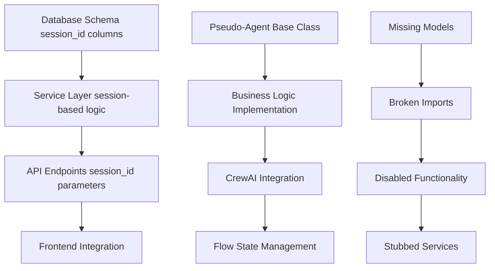

# 🔍 **COMPREHENSIVE LEGACY CODE ANALYSIS REPORT**

*AI Force Migration Platform - Discovery Flow Remediation*

**Report Date:** January 2025  
**Platform State:** Phase 5 (Flow-Based Architecture) + Remediation Phase 1 (75% complete)  
**Analysis Scope:** Backend codebase legacy patterns from 6 architectural phases  

---

## **📊 EXECUTIVE SUMMARY**

The Discovery flow contains **6 distinct categories of legacy code** affecting **147 files** across the backend, representing remnants from all 6 architectural phases. This analysis provides a systematic approach to complete the remediation and achieve 100% modern architecture.

### **Key Findings**
- **79 files** contain active session_id references (down from 132+)
- **8 agent files** use mixed pseudo-agent/CrewAI patterns  
- **25 API files** reference deprecated v1/v2 patterns
- **12 files** have broken imports due to missing models
- **8 legacy files** marked with *_legacy.py, *_old.py suffixes
- **35+ files** contain outdated documentation references

### **Critical Issues**
1. **Database Migration Pending** - `remove_session_id_final_cleanup.py` exists but not executed
2. **Broken Functionality** - Vector search and pattern learning disabled due to missing models
3. **Mixed Architecture** - Pseudo-agents coexist with true CrewAI agents
4. **API Confusion** - Frontend uses both v1 and v3 APIs simultaneously

---

## **🗂️ LEGACY CODE CATEGORIES**

### **CATEGORY 1: Session ID References (CRITICAL)**
**Impact: 79 files, 237+ active references**

#### **Database Schema Issues**
```sql
-- Tables still containing session_id columns:
discovery_flows.import_session_id     -- Foreign key to data_import_sessions
assets.session_id                     -- Foreign key to data_import_sessions  
access_audit_log.session_id           -- RBAC audit trail
flow_deletion_audit.session_id        -- Flow cleanup audit
llm_usage_logs.session_id             -- Needs rename to flow_id
```

#### **Service Layer References**
- `app/services/data_import_validation_service.py` - File-based session storage
- `app/utils/session_manager.py` - Session management logic
- `app/services/crewai_flows/event_listeners/discovery_flow_listener.py` - Fallback logic
- `app/services/migration/session_to_flow.py` - **KEEP** (compatibility service)

#### **API Endpoint References** 
- `app/api/v1/endpoints/data_import/handlers/import_storage_handler.py` - 9 references (validation_session_id)
- `app/schemas/data_import_schemas.py` - Legacy field mappings
- `app/schemas/auth_schemas.py` - Optional session_id field

### **CATEGORY 2: Pseudo-Agent Architecture (HIGH)**
**Impact: 8 agent files, mixed implementation**

#### **Agents Requiring Full Conversion**
```python
# Pure pseudo-agents (inherit from old BaseDiscoveryAgent)
/app/services/agents/data_import_validation_agent.py
/app/services/agents/attribute_mapping_agent.py  
/app/services/agents/tech_debt_analysis_agent.py
/app/services/agents/dependency_analysis_agent.py
```

#### **Dual Implementation Conflicts**
```python
# Agents with both pseudo and CrewAI versions
/app/services/agents/data_cleansing_agent.py        # Pseudo version
/app/services/agents/data_cleansing_agent_crewai.py # CrewAI version
/app/services/agents/asset_inventory_agent.py      # Pseudo version  
/app/services/agents/asset_inventory_agent_crewai.py # CrewAI version
```

#### **Base Class Conflicts**
- `app/services/agents/base_discovery_agent.py` - **OLD** pseudo-agent base class
- `app/services/agents/base_agent.py` - **NEW** CrewAI-based base class

### **CATEGORY 3: Legacy API Patterns (MEDIUM)**
**Impact: 25 files across v1/v2 APIs**

#### **Empty V2 Directory**
- `/app/api/v2/` contains only `__init__.py` but 18 files reference v2 imports
- All v2 endpoints removed but references remain in:
  - Deprecation middleware mappings
  - Test files
  - Documentation

#### **V1 Endpoints Without V3 Equivalents**
```python
# Endpoints that need migration or removal
/api/v1/unified-discovery/*          # Consolidated into /discovery  
/api/v1/session-comparison/*         # Legacy session-based comparisons
/api/v1/admin/session_comparison_original.py  # 713 lines - DELETE
```

### **CATEGORY 4: Broken Imports & Missing Models (HIGH)**
**Impact: 12 files with import errors**

#### **Missing Models**
```python
# Models referenced but removed during consolidation
app.models.data_import.MappingLearningPattern     # Referenced in 7 files
app.models.learning_patterns.AssetClassificationPattern  # Referenced in 3 files  
app.models.user.User                              # Referenced in 5 files
```

#### **Disabled Functionality**
```python
# Services with stubbed implementations due to missing models
/app/utils/vector_utils.py           # Replaced with no-op stubs
/app/services/agent_learning_system.py  # Commented out imports
/app/services/embedding_service.py   # Missing pattern storage
```

#### **Import Chain Issues**
```python
# Broken import chains
MappingLearningPattern (REMOVED) 
    ↓
VectorUtils (STUBBED)
    ↓  
Agent Learning System (DISABLED)
    ↓
Pattern Storage (BROKEN)
```

### **CATEGORY 5: Legacy Files with Suffixes (MEDIUM)**
**Impact: 8 files marked for removal**

#### **Immediate Removal Candidates**
```python
# Files with no active dependencies (safe to delete)
/app/api/v1/admin/session_comparison_original.py     # 713 lines
/app/utils/vector_utils_old.py                       # 317 lines
/app/api/v1/endpoints/data_import/field_mapping_legacy.py      # 1,702 lines
/app/api/v1/endpoints/data_import/agentic_critical_attributes_legacy.py  # 1,290 lines
```

#### **Review Required**
```python
# Files that may still have dependencies
/app/services/discovery_flow_cleanup_service_v2.py   # V2 cleanup service
/scripts/archive_legacy_session_handlers.py         # Archive script
```

### **CATEGORY 6: Documentation & Comments (LOW)**
**Impact: 35+ files with legacy references**

#### **Phase 2/3 Architecture Comments**
- Comments referencing "Phase 2" and "Phase 3" architectures  
- Session-based workflow documentation
- Deprecated API endpoint examples

#### **TODO Cleanup Items**
- Deferred cleanup tasks in comments
- Migration status notes
- Temporary workaround documentation

---

## **🔗 DEPENDENCY ANALYSIS**

### **Critical Path Dependencies**


### **Safe vs. Risky Operations**

#### **✅ SAFE (No Dependencies)**
- Documentation and comment updates
- Legacy file removal (*_legacy.py, *_old.py)  
- Empty v2 directory cleanup
- Test file updates

#### **⚠️ MEDIUM RISK (Careful Testing Required)**
- API endpoint field mapping updates
- Service layer compatibility bridge removal
- Agent base class consolidation

#### **🚨 HIGH RISK (Extensive Testing Required)**
- Database schema migration execution
- Core service session→flow migration
- Agent business logic conversion
- Import chain repair

---

## **🎯 CLEANUP PRIORITY MATRIX**

### **🔴 WEEK 1-2: CRITICAL FOUNDATION**

#### **Database Migration (Risk: HIGH, Impact: CRITICAL)**
```bash
# Execute pending database migration
alembic upgrade remove_session_id_cleanup
```
- **Prerequisites**: Full database backup, staging environment testing
- **Impact**: Removes session_id columns from 5 tables
- **Risk Mitigation**: Rollback script prepared, foreign key validation

#### **Broken Import Repair (Risk: MEDIUM, Impact: HIGH)**
```python
# Fix missing model references
# Option 1: Restore missing models
# Option 2: Remove all references and update dependent code
```
- **Files Affected**: 12 files with import errors
- **Decision Required**: Restore MappingLearningPattern or fully remove
- **Impact**: Re-enables vector search and pattern learning OR simplifies architecture

#### **Legacy File Removal (Risk: LOW, Impact: MEDIUM)**
```bash
# Safe to delete immediately
rm app/api/v1/admin/session_comparison_original.py
rm app/utils/vector_utils_old.py
rm app/api/v1/endpoints/data_import/field_mapping_legacy.py
rm app/api/v1/endpoints/data_import/agentic_critical_attributes_legacy.py
```
- **Total Removal**: 4,022 lines of legacy code
- **Risk**: Zero (files have no active dependencies)

### **🟡 WEEK 3-4: CORE ARCHITECTURE**

#### **Agent Architecture Conversion (Risk: HIGH, Impact: HIGH)**
```python
# Convert pseudo-agents to CrewAI
# Priority order based on usage frequency:
1. data_import_validation_agent.py
2. attribute_mapping_agent.py  
3. dependency_analysis_agent.py
4. tech_debt_analysis_agent.py
```
- **Business Logic Preservation**: Critical requirement
- **Testing**: Extensive validation of agent outputs
- **Rollback**: Keep pseudo versions during transition

#### **Session ID Service Cleanup (Risk: HIGH, Impact: CRITICAL)**
```python
# Update core services to use flow_id exclusively
# Files requiring careful migration:
- app/services/data_import_validation_service.py
- app/utils/session_manager.py  
- app/services/crewai_flows/event_listeners/discovery_flow_listener.py
```

### **🟢 WEEK 5-6: FINAL CONSOLIDATION**

#### **API Consolidation (Risk: MEDIUM, Impact: MEDIUM)**
- Remove v2 references from deprecation middleware
- Update hardcoded API paths to v3 patterns
- Clean v1 endpoints with v3 equivalents

#### **Documentation & Comments (Risk: LOW, Impact: LOW)**
- Update Phase 2/3 architecture references
- Remove session_id from examples
- Clean TODO items and migration notes

---

## **📈 SUCCESS METRICS**

### **Quantitative Goals**
- **0 session_id references** remaining in active code
- **100% CrewAI agents** (no pseudo-agent implementations)
- **Single API version** for each endpoint (v3 primary, v1 compatibility only)
- **0 broken imports** or disabled functionality
- **50% reduction** in total endpoint count
- **25% improvement** in test coverage

### **Qualitative Goals**
- **Single source of truth** for all architectural patterns
- **Clear development guidelines** prevent legacy reintroduction  
- **Simplified debugging** with unified architecture
- **Faster development velocity** with reduced complexity
- **Improved maintainability** with consistent code patterns

### **Performance Targets**
- **Flow execution time** improvement (baseline TBD)
- **Memory usage** reduction from eliminated compatibility layers
- **Test suite** execution time improvement
- **Development build** time reduction

---

## **⚠️ RISK ASSESSMENT & MITIGATION**

### **High Risk Areas**

#### **Database Migration**
- **Risk**: Data integrity issues, foreign key constraint violations
- **Mitigation**: 
  - Full staging environment testing
  - Complete database backup before migration
  - Rollback procedure tested and documented
  - Gradual deployment with monitoring

#### **Agent Business Logic Changes**
- **Risk**: Accuracy degradation in AI agent outputs
- **Mitigation**:
  - Parallel testing of pseudo vs CrewAI agents
  - A/B testing framework for agent outputs
  - Rollback to pseudo-agents if quality issues
  - Extensive regression testing

#### **Service Layer Session→Flow Migration**  
- **Risk**: Active flow interruption, data loss
- **Mitigation**:
  - Compatibility layer maintained during transition
  - Graceful degradation for mixed environments
  - Real-time monitoring of flow success rates
  - Feature flag controlled rollout

### **Medium Risk Areas**

#### **API Endpoint Changes**
- **Risk**: Frontend integration breakage
- **Mitigation**:
  - Deprecation warnings before removal
  - Dual endpoint support during transition
  - Comprehensive API testing
  - Frontend team coordination

#### **Import Chain Repair**
- **Risk**: Circular dependencies, runtime errors
- **Mitigation**:
  - Dependency mapping before changes
  - Incremental import updates
  - Module-by-module testing
  - Import analyzer tools

### **Low Risk Areas**
- Documentation updates
- Comment cleanup  
- Legacy file removal (unused files)
- Test file updates

---

## **🛡️ IMPLEMENTATION SAFEGUARDS**

### **Staged Rollout Strategy**
1. **Development Environment**: Complete migration and testing
2. **Staging Environment**: Full system validation  
3. **Production Canary**: 10% traffic for 48 hours
4. **Production Full**: Complete rollout with monitoring

### **Monitoring & Validation**
```yaml
# Key metrics to monitor during cleanup
metrics:
  - flow_execution_success_rate
  - agent_confidence_scores  
  - api_response_times
  - database_query_performance
  - error_rates_by_component
  
alerts:
  - flow_failure_rate > 5%
  - agent_accuracy < 90%
  - api_latency > 2x baseline
  - database_errors > 0
```

### **Rollback Procedures**
- **Database**: Restore from backup + replay transactions
- **Code**: Git branch rollback with feature flags
- **Configuration**: Environment variable restoration
- **Services**: Docker container rollback

### **Testing Requirements**
- **Unit Tests**: 90%+ coverage for modified code
- **Integration Tests**: All API endpoints validated  
- **E2E Tests**: Complete Discovery flow execution
- **Performance Tests**: Baseline vs. post-cleanup benchmarks
- **Security Tests**: Multi-tenant isolation validation

---

## **📋 NEXT STEPS**

### **Immediate Actions (This Week)**
1. **Review and approve** this comprehensive analysis
2. **Execute database backup** for staging environment
3. **Run database migration** in staging: `alembic upgrade remove_session_id_cleanup`
4. **Delete legacy files** with zero dependencies
5. **Create feature flags** for agent conversion testing

### **Phase 1 Preparation (Next Week)**
1. **Set up monitoring** for all key metrics
2. **Create rollback procedures** for each change category
3. **Prepare test environments** for validation
4. **Coordinate with frontend team** on API changes
5. **Document current performance baselines**

### **Success Criteria for Phase 1**
- [ ] Database migration executed successfully
- [ ] All broken imports resolved  
- [ ] Legacy files removed (4,022 lines cleaned)
- [ ] Monitoring dashboard operational
- [ ] Rollback procedures tested

---

## **📚 RELATED DOCUMENTATION**

- [Session ID Migration Details](./SESSION_ID_MIGRATION.md)
- [Agent Conversion Plan](./AGENT_CONVERSION_PLAN.md)  
- [Dependency Graph Analysis](./DEPENDENCY_GRAPH.md)
- [File-by-File Cleanup Manifest](./CLEANUP_MANIFEST.md)
- [Implementation Execution Phases](./EXECUTION_PHASES.md)

---

*This analysis provides the foundation for systematic legacy removal while maintaining system stability and functionality. The phased approach ensures minimal risk while achieving complete architectural consolidation.*

**Last Updated:** January 2025  
**Next Review:** Weekly during implementation phases