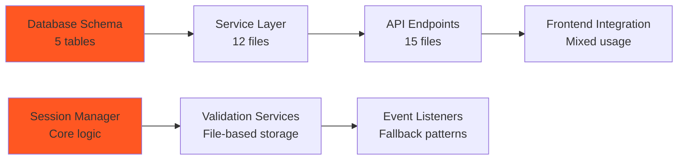

# 🔄 **SESSION ID MIGRATION GUIDE**

*AI Force Migration Platform - Discovery Flow Remediation*

**Migration Date:** January 2025  
**Scope:** Complete session_id → flow_id migration  
**Files Affected:** 79 files with 237+ active references  

---

## **📊 MIGRATION OVERVIEW**

### **Current State**
- **79 files** contain session_id references
- **5 database tables** have session_id columns
- **Mixed architecture** with both session_id and flow_id patterns
- **Database migration** prepared but not executed

### **Target State**
- **0 session_id references** in active code
- **Flow_id as primary identifier** throughout system
- **Unified architecture** with consistent patterns
- **Compatibility layer** for emergency rollback

### **Migration Scope**


---

## **🗄️ DATABASE MIGRATION**

### **Schema Changes Required**
```sql
-- Tables affected by migration
-- 1. discovery_flows table
ALTER TABLE discovery_flows DROP COLUMN import_session_id;

-- 2. assets table  
ALTER TABLE assets DROP COLUMN session_id;

-- 3. access_audit_log table
ALTER TABLE access_audit_log DROP COLUMN session_id;

-- 4. flow_deletion_audit table
ALTER TABLE flow_deletion_audit DROP COLUMN session_id;

-- 5. llm_usage_logs table (rename existing column)
ALTER TABLE llm_usage_logs RENAME COLUMN session_id TO flow_id;
```

### **Migration Script Analysis**
**File**: `alembic/versions/remove_session_id_final_cleanup.py`

```python
# Migration details:
revision = 'remove_session_id_cleanup'
down_revision = '001_complete_schema'

def upgrade():
    # Drop session_id columns from all tables
    op.drop_column('discovery_flows', 'import_session_id')
    op.drop_column('assets', 'session_id') 
    op.drop_column('access_audit_log', 'session_id')
    op.drop_column('flow_deletion_audit', 'session_id')
    
    # Rename session_id to flow_id in llm_usage_logs
    op.execute("ALTER TABLE llm_usage_logs RENAME COLUMN session_id TO flow_id")
    
    # Drop related indexes
    op.execute("DROP INDEX IF EXISTS idx_discovery_flows_import_session_id")
    op.execute("DROP INDEX IF EXISTS idx_assets_session_id")
    op.execute("DROP INDEX IF EXISTS idx_access_audit_log_session_id")

def downgrade():
    # Not supported - final cleanup migration
    raise NotImplementedError("Downgrade not supported for session_id cleanup")
```

### **Pre-Migration Validation**
```bash
# Verify current database state
psql -d migration_db -c "
SELECT table_name, column_name 
FROM information_schema.columns 
WHERE column_name LIKE '%session_id%';"

# Check for data in session_id columns
psql -d migration_db -c "
SELECT 
  'discovery_flows' as table_name,
  COUNT(*) as rows_with_session_id
FROM discovery_flows 
WHERE import_session_id IS NOT NULL
UNION ALL
SELECT 
  'assets' as table_name,
  COUNT(*) as rows_with_session_id  
FROM assets
WHERE session_id IS NOT NULL;"
```

### **Migration Execution**
```bash
# 1. Create database backup
pg_dump migration_db > migration_backup_$(date +%Y%m%d_%H%M%S).sql

# 2. Execute migration in staging
export DATABASE_URL=postgresql://staging_connection_string
alembic upgrade remove_session_id_cleanup

# 3. Validate migration success
psql -d migration_db -c "
SELECT table_name, column_name 
FROM information_schema.columns 
WHERE column_name LIKE '%session_id%';"
# Expected: Only data_import_sessions table should have session_id

# 4. Execute in production (after staging validation)
export DATABASE_URL=postgresql://production_connection_string  
alembic upgrade remove_session_id_cleanup
```

### **Post-Migration Validation**
```sql
-- Verify columns removed
SELECT table_name, column_name 
FROM information_schema.columns 
WHERE table_name IN ('discovery_flows', 'assets', 'access_audit_log', 'flow_deletion_audit')
AND column_name = 'session_id';
-- Expected: 0 rows

-- Verify llm_usage_logs column renamed
SELECT column_name 
FROM information_schema.columns 
WHERE table_name = 'llm_usage_logs' 
AND column_name IN ('session_id', 'flow_id');
-- Expected: Only 'flow_id'

-- Verify indexes removed
SELECT indexname 
FROM pg_indexes 
WHERE indexname LIKE '%session_id%';
-- Expected: 0 rows
```

---

## **⚙️ SERVICE LAYER MIGRATION**

### **Core Service Updates**

#### **1. Session Manager → Flow Manager**
**File**: `app/utils/session_manager.py`

**Current Implementation**:
```python
class SessionManager:
    def create_session(self, client_account_id: str) -> str:
        session_id = f"disc_session_{uuid.uuid4().hex[:8]}"
        # Store session data
        return session_id
    
    def get_session_data(self, session_id: str) -> Dict[str, Any]:
        # Retrieve session-based data
        pass
```

**Migration Options**:

**Option A: Convert to FlowManager**
```python
class FlowManager:
    def create_flow(self, client_account_id: str) -> str:
        flow_id = str(uuid.uuid4())
        # Store flow data using flow_id
        return flow_id
    
    def get_flow_data(self, flow_id: str) -> Dict[str, Any]:
        # Retrieve flow-based data
        pass
```

**Option B: Remove Entirely**
```python
# Delete session_manager.py
# Use direct flow_id throughout application
# Rely on UnifiedDiscoveryFlow for state management
```

#### **2. Data Import Validation Service**
**File**: `app/services/data_import_validation_service.py`

**Current Session-Based Pattern**:
```python
class DataImportValidationService:
    def validate_import(self, session_id: str, file_path: str):
        # Store validation results in session-based storage
        session_dir = f"/tmp/validation_sessions/{session_id}"
        os.makedirs(session_dir, exist_ok=True)
        
        validation_file = f"{session_dir}/validation_results.json"
        with open(validation_file, 'w') as f:
            json.dump(results, f)
```

**Target Flow-Based Pattern**:
```python
class DataImportValidationService:
    def validate_import(self, flow_id: str, file_path: str):
        # Store validation results in flow-based storage
        flow_dir = f"/tmp/validation_flows/{flow_id}"
        os.makedirs(flow_dir, exist_ok=True)
        
        validation_file = f"{flow_dir}/validation_results.json"
        with open(validation_file, 'w') as f:
            json.dump(results, f)
```

**Migration Steps**:
1. Update method signatures: `session_id` → `flow_id`
2. Update file storage paths: `validation_sessions` → `validation_flows`
3. Update database queries to use flow_id
4. Update error messages and logging

#### **3. Event Listener Cleanup**
**File**: `app/services/crewai_flows/event_listeners/discovery_flow_listener.py`

**Current Fallback Pattern**:
```python
class DiscoveryFlowListener:
    async def handle_flow_event(self, event_data: Dict[str, Any]):
        # Try flow_id first, fallback to session_id
        flow_id = event_data.get('flow_id')
        if not flow_id:
            session_id = event_data.get('session_id')
            if session_id:
                flow_id = await self._convert_session_to_flow(session_id)
```

**Target Pattern**:
```python
class DiscoveryFlowListener:
    async def handle_flow_event(self, event_data: Dict[str, Any]):
        # Use flow_id exclusively
        flow_id = event_data.get('flow_id')
        if not flow_id:
            raise ValueError("flow_id is required for all flow events")
```

---

## **🔌 API ENDPOINT MIGRATION**

### **Data Import Handler Updates**

#### **Import Storage Handler**
**File**: `app/api/v1/endpoints/data_import/handlers/import_storage_handler.py`

**Current Implementation** (9 session_id references):
```python
class ImportStorageHandler:
    async def store_import_data(
        self,
        validation_session_id: str,
        import_data: Dict[str, Any]
    ):
        # Store using session-based keys
        storage_key = f"import_session_{validation_session_id}"
```

**Target Implementation**:
```python
class ImportStorageHandler:
    async def store_import_data(
        self,
        validation_flow_id: str,
        import_data: Dict[str, Any]
    ):
        # Store using flow-based keys
        storage_key = f"import_flow_{validation_flow_id}"
```

**Breaking Changes**:
- Parameter name change: `validation_session_id` → `validation_flow_id`
- Storage key format change
- Error message updates

### **Schema Updates**

#### **Data Import Schemas**
**File**: `app/schemas/data_import_schemas.py`

**Current Schema**:
```python
class DataImportRequest(BaseModel):
    client_account_id: str
    engagement_id: str
    session_id: Optional[str] = None  # Legacy field
    file_data: bytes
```

**Target Schema**:
```python
class DataImportRequest(BaseModel):
    client_account_id: str
    engagement_id: str
    flow_id: Optional[str] = None  # Modern field
    file_data: bytes
```

#### **Auth Schemas**  
**File**: `app/schemas/auth_schemas.py`

**Current Schema**:
```python
class UserSession(BaseModel):
    user_id: str
    session_id: Optional[str] = None
    flow_id: Optional[str] = None
```

**Target Schema**:
```python
class UserSession(BaseModel):
    user_id: str
    flow_id: str  # Required field
```

---

## **🔄 COMPATIBILITY LAYER**

### **Session-to-Flow Service**
**File**: `app/services/migration/session_to_flow.py` (KEEP)

This file provides compatibility during transition and emergency rollback:

```python
class SessionToFlowCompatibilityService:
    async def convert_session_to_flow(self, session_id: str) -> Optional[str]:
        """Convert legacy session_id to modern flow_id"""
        # Implementation for backward compatibility
        
    async def handle_legacy_request(self, request_data: Dict[str, Any]) -> Dict[str, Any]:
        """Handle requests with session_id and convert to flow_id"""
        if 'session_id' in request_data and 'flow_id' not in request_data:
            flow_id = await self.convert_session_to_flow(request_data['session_id'])
            request_data['flow_id'] = flow_id
            del request_data['session_id']
        return request_data
```

**Retention Period**: 6 months after migration completion

---

## **📋 MIGRATION CHECKLIST**

### **Phase 1: Database Foundation (Week 1)**
- [ ] **Pre-Migration**
  - [ ] Create full database backup
  - [ ] Validate staging environment
  - [ ] Verify no active flows during migration window
  
- [ ] **Migration Execution**
  - [ ] Execute `alembic upgrade remove_session_id_cleanup` in staging
  - [ ] Validate schema changes in staging
  - [ ] Test application functionality in staging
  - [ ] Execute migration in production
  
- [ ] **Post-Migration Validation**
  - [ ] Verify columns removed successfully
  - [ ] Confirm no foreign key constraint issues
  - [ ] Test basic application functionality
  - [ ] Monitor for any immediate issues

### **Phase 2: Service Layer Updates (Week 2)**
- [ ] **Session Manager**
  - [ ] Decide: Convert to FlowManager vs Remove entirely
  - [ ] Update all service references
  - [ ] Test service integration
  
- [ ] **Data Import Validation**
  - [ ] Update method signatures
  - [ ] Change file storage paths
  - [ ] Update database queries
  - [ ] Test import validation flow
  
- [ ] **Event Listeners**
  - [ ] Remove session_id fallback logic
  - [ ] Update event handling to flow_id only
  - [ ] Test CrewAI flow events

### **Phase 3: API Endpoint Updates (Week 2-3)**
- [ ] **Import Handlers**
  - [ ] Update parameter names
  - [ ] Change storage key formats
  - [ ] Update error messages
  - [ ] Test API endpoints
  
- [ ] **Schema Updates**
  - [ ] Update Pydantic models
  - [ ] Remove optional session_id fields
  - [ ] Make flow_id required where appropriate
  - [ ] Update API documentation

### **Phase 4: Integration Testing (Week 3)**
- [ ] **End-to-End Testing**
  - [ ] Test complete discovery flow
  - [ ] Verify data import functionality
  - [ ] Test field mapping with flow_id
  - [ ] Validate asset creation
  
- [ ] **Error Handling**
  - [ ] Test error scenarios
  - [ ] Verify error messages use flow_id
  - [ ] Test rollback scenarios
  
- [ ] **Performance Testing**
  - [ ] Benchmark flow execution times
  - [ ] Monitor database performance
  - [ ] Validate memory usage

---

## **🧪 TESTING STRATEGY**

### **Unit Tests**
```python
# Test session_id removal
def test_no_session_id_references():
    """Verify no session_id references in active code"""
    import subprocess
    result = subprocess.run(
        ['grep', '-r', 'session_id', 'app/', '--include=*.py'],
        capture_output=True, text=True
    )
    # Filter out comments and migration compatibility
    active_refs = [line for line in result.stdout.split('\n') 
                   if line and not line.strip().startswith('#')]
    assert len(active_refs) == 0, f"Found session_id references: {active_refs}"

# Test flow_id usage
def test_flow_id_required():
    """Verify flow_id is used throughout application"""
    from app.services.data_import_validation_service import DataImportValidationService
    service = DataImportValidationService()
    
    # Should accept flow_id parameter
    import inspect
    sig = inspect.signature(service.validate_import)
    assert 'flow_id' in sig.parameters
    assert 'session_id' not in sig.parameters
```

### **Integration Tests**
```python
# Test complete discovery flow with flow_id
async def test_discovery_flow_integration():
    """Test end-to-end discovery flow using flow_id"""
    # Create flow
    flow_id = str(uuid.uuid4())
    
    # Test data import
    import_result = await data_import_service.import_data(
        flow_id=flow_id,
        client_account_id="test_client",
        file_data=test_file_data
    )
    assert import_result.flow_id == flow_id
    
    # Test validation
    validation_result = await validation_service.validate_import(
        flow_id=flow_id,
        file_path=import_result.file_path
    )
    assert validation_result.flow_id == flow_id
    
    # Test flow completion
    flow_status = await flow_service.get_flow_status(flow_id)
    assert flow_status.flow_id == flow_id
```

### **Database Tests**
```sql
-- Test schema migration
SELECT COUNT(*) FROM information_schema.columns 
WHERE column_name = 'session_id' 
AND table_name NOT IN ('data_import_sessions');
-- Expected: 0

-- Test data integrity after migration
SELECT COUNT(*) FROM discovery_flows WHERE flow_id IS NULL;
-- Expected: 0

-- Test llm_usage_logs column rename
SELECT COUNT(*) FROM llm_usage_logs WHERE flow_id IS NOT NULL;
-- Expected: > 0 (if any usage logs exist)
```

---

## **📊 MONITORING & VALIDATION**

### **Key Metrics to Monitor**
```yaml
migration_metrics:
  database:
    - migration_execution_time
    - schema_validation_success
    - foreign_key_constraint_violations: 0
    
  application:
    - flow_creation_success_rate: >95%
    - api_response_times: <2x baseline
    - error_rates: <5% increase
    
  business:
    - discovery_flow_completion_rate: >90%
    - data_import_success_rate: >95%
    - user_session_continuity: >98%
```

### **Alerting Rules**
```yaml
alerts:
  - name: MigrationFailure
    condition: migration_errors > 0
    severity: critical
    
  - name: FlowCreationFailure  
    condition: flow_creation_errors > 5
    severity: high
    
  - name: APIResponseDegradation
    condition: api_response_time > 2x baseline
    severity: medium
    
  - name: DatabaseConstraintViolation
    condition: foreign_key_errors > 0
    severity: critical
```

---

## **🚨 ROLLBACK PROCEDURES**

### **Database Rollback**
```bash
# Emergency database rollback
# 1. Stop application
docker-compose down

# 2. Restore database from backup
pg_restore --clean --if-exists migration_backup.sql

# 3. Verify restoration
psql -d migration_db -c "
SELECT table_name, column_name 
FROM information_schema.columns 
WHERE column_name = 'session_id';"

# 4. Restart application with compatibility mode
export SESSION_COMPATIBILITY_MODE=true
docker-compose up -d
```

### **Application Rollback**
```bash
# Code rollback using feature flags
export LEGACY_SESSION_ID_ENABLED=true
export FLOW_ID_MIGRATION_ENABLED=false

# Or git rollback
git checkout session-migration-rollback-branch
docker-compose up -d --build
```

### **Partial Rollback**
```python
# Enable session-to-flow compatibility service
class MigrationRollbackService:
    def __init__(self):
        self.session_compatibility_enabled = True
        
    async def handle_request(self, request_data):
        if self.session_compatibility_enabled:
            # Convert flow_id back to session_id for legacy services
            if 'flow_id' in request_data:
                session_id = await self.convert_flow_to_session(request_data['flow_id'])
                request_data['session_id'] = session_id
        return request_data
```

---

## **✅ SUCCESS CRITERIA**

### **Technical Success**
- [ ] **0 session_id references** in active application code
- [ ] **100% flow_id usage** in all new flows
- [ ] **Database migration** completed successfully
- [ ] **No foreign key constraint violations**
- [ ] **All tests passing** with flow_id patterns

### **Business Success**
- [ ] **Discovery flows complete** successfully with flow_id
- [ ] **Data import functionality** working with flow_id
- [ ] **Field mapping** operational with flow_id
- [ ] **Asset creation** functional with flow_id
- [ ] **User experience** unchanged or improved

### **Performance Success**
- [ ] **Flow execution time** within 5% of baseline
- [ ] **API response times** within 10% of baseline
- [ ] **Database query performance** maintained or improved
- [ ] **Memory usage** stable or reduced

---

## **📅 TIMELINE SUMMARY**

| Week | Focus | Key Deliverables |
|------|-------|------------------|
| 1 | Database Foundation | Migration executed, schema validated |
| 2 | Service Layer | Core services updated to flow_id |
| 3 | API Integration | Endpoints updated, schemas migrated |
| 4 | Testing & Validation | E2E testing, performance validation |

**Total Duration**: 4 weeks  
**Risk Level**: High (database changes)  
**Rollback Complexity**: Medium (backup restoration required)

---

*This migration guide provides the complete roadmap for transitioning from session_id to flow_id architecture while maintaining system stability and functionality.*

**Last Updated:** January 2025  
**Next Review:** Weekly during migration phases