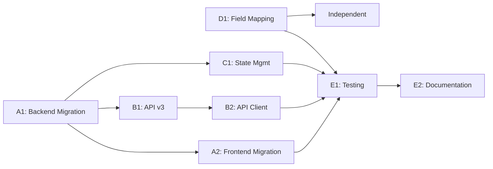

# Phase 1 Parallel Execution Coordination Guide

## Overview
This guide coordinates the parallel execution of Phase 1 remediation by multiple Claude Code agents. Each agent has specific tasks that can be executed independently with minimal blocking dependencies.

## Agent Assignment Summary

| Agent | Track | Focus Area | Priority | Dependencies |
|-------|-------|------------|----------|--------------|
| A1 | Backend Migration | Session→Flow ID migration | CRITICAL | None |
| A2 | Frontend Migration | Session→Flow ID migration | CRITICAL | A1 for API contract |
| B1 | Backend API | v3 API consolidation | HIGH | A1 for flow_id |
| B2 | Frontend API | v3 TypeScript client | HIGH | B1 for API spec |
| C1 | State Management | PostgreSQL-only state | HIGH | None |
| D1 | Field Mapping | User-facing fixes | MEDIUM | None |
| E1 | Testing | Test coverage & automation | MEDIUM | All agents |
| E2 | Documentation | Docs & ADRs | MEDIUM | All agents |

## Execution Timeline

### Day 1 - Kickoff
**All agents start simultaneously**

Morning:
- Each agent reads their task file
- Agents create their working branches
- Initial code exploration and planning

Afternoon:
- A1 creates migration script structure
- A2 identifies all session_id references
- B1 designs v3 API structure
- B2 sets up TypeScript client structure
- C1 analyzes current state management
- D1 fixes dropdown issue
- E1 sets up test frameworks
- E2 creates documentation structure

### Day 2-3 - Core Implementation
- Agents work independently on their tracks
- Daily sync via PR comments
- Share interfaces/types via common files

### Day 4 - Integration
- Agents test integration points
- Fix any conflicts
- E1 runs comprehensive tests
- E2 documents all changes

### Day 5 - Final Testing & Merge
- All agents verify their changes
- Integration testing
- Merge to develop branch
- Phase 1 complete

## Coordination Points

### Shared Files & Interfaces

**Backend Types** (`backend/app/schemas/base.py`):
```python
# Shared by A1, B1, C1
class FlowIdentifier(BaseModel):
    flow_id: str
    # session_id: Optional[str] = None  # Deprecated
```

**Frontend Types** (`src/types/discovery.ts`):
```typescript
// Shared by A2, B2, D1
export interface FlowIdentifier {
  flowId: string;
  sessionId?: string; // @deprecated
}
```

**API Contract** (`docs/api/v3/openapi.yaml`):
- B1 creates and maintains
- B2 generates types from this
- All agents reference for API calls

### Communication Protocol

1. **Branch Naming**:
   ```
   feature/phase1-[track]-[agent]-[description]
   Example: feature/phase1-a1-session-flow-migration
   ```

2. **Commit Messages**:
   ```
   [Phase1-{Agent}] Description
   Example: [Phase1-A1] Add session to flow migration script
   ```

3. **PR Titles**:
   ```
   feat: [Phase1-{Agent}] Description
   Example: feat: [Phase1-B1] API v3 consolidation
   ```

4. **Blocking Issues**:
   - Tag with `blocking-phase1`
   - Mention affected agent in PR comment
   - Use @mentions for urgent issues

### Integration Points

#### A1 ↔ A2 (Session Migration)
- **Handoff**: A1 provides migration completion signal
- **Shared**: Flow ID format and conversion logic
- **Test**: A2 tests frontend with migrated data

#### B1 ↔ B2 (API Development)
- **Handoff**: B1 provides OpenAPI spec
- **Shared**: Endpoint URLs and response formats
- **Test**: B2 tests client against B1's endpoints

#### C1 → All (State Management)
- **Impact**: All agents using state must adapt
- **Shared**: State structure and access patterns
- **Test**: Integration tests for state operations

#### D1 → Users (Field Mapping)
- **Impact**: Immediate user-facing improvements
- **Coordination**: Minimal, but test thoroughly
- **Test**: E2E tests for user workflows

### Conflict Resolution

**Code Conflicts**:
1. Agent who created file has priority
2. Discuss in PR comments
3. Escalate to team lead if needed

**Design Conflicts**:
1. Reference remediation plan
2. Seek consensus in PR
3. Document decision in ADR

**Time Conflicts**:
1. Critical path agents (A1, A2) have priority
2. Other agents adapt or work around
3. Update coordination guide

## Critical Path



## Success Metrics

### Phase 1 Complete When:
- [ ] All session_id references replaced with flow_id
- [ ] v3 API fully functional
- [ ] State management using PostgreSQL only
- [ ] Field mapping issues resolved
- [ ] 80% test coverage achieved
- [ ] All documentation complete
- [ ] Zero regression bugs
- [ ] All PRs merged to develop

### Quality Gates:
- No PR merged without tests
- No PR merged without documentation
- All TypeScript strict mode passing
- All Python type hints present
- Performance benchmarks met

## Daily Standup Template

```markdown
## Agent [X] - Day [N] Update

### Completed:
- Task 1
- Task 2

### In Progress:
- Task 3 (70% complete)

### Blockers:
- Waiting for Agent Y to complete Z

### Today's Plan:
- Complete Task 3
- Start Task 4

### Help Needed:
- Review PR #123
- Clarification on API design
```

## Emergency Procedures

### If an Agent is Blocked:
1. Post in PR with `blocking-phase1` label
2. Try to work on non-blocked tasks
3. Help other agents if completely blocked
4. Document the blocker clearly

### If Timeline Slips:
1. Focus on critical path items
2. Defer nice-to-have features
3. E1/E2 can help with implementation
4. Consider reducing scope

### If Major Issues Found:
1. Stop and assess impact
2. Create emergency fix PR
3. All agents review
4. Adjust plan as needed

## Tools & Resources

### Useful Commands:
```bash
# Check for session_id references
grep -r "session_id" --include="*.py" --include="*.ts" --include="*.tsx" .

# Find flow_id usage
grep -r "flow_id" --include="*.py" --include="*.ts" --include="*.tsx" .

# Run specific agent tests
pytest tests/phase1/test_agent_a1.py

# Check git branch status
git branch -a | grep phase1
```

### Monitoring Progress:
- GitHub Project Board
- PR merge status
- Test coverage reports
- Daily standup updates

## Notes
- Stay focused on Phase 1 scope
- Don't refactor beyond requirements
- Communicate early and often
- Test integration points thoroughly
- Keep documentation updated