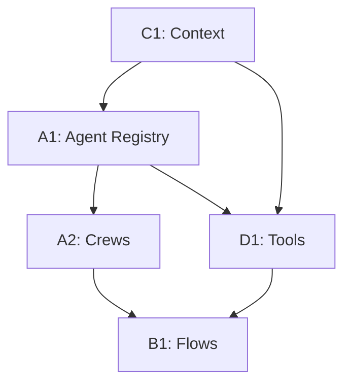

# Phase 2 Parallel Execution Coordination Guide

## Overview
This guide coordinates the parallel execution of Phase 2 remediation by 5 Claude Code agents. Phase 2 focuses on transforming the platform to proper CrewAI architecture with agents, crews, flows, tools, and context management.

## Agent Assignment Summary

| Agent | Track | Focus Area | Priority | Dependencies |
|-------|-------|------------|----------|--------------|
| A1 | Agent System | Core agent infrastructure & registry | CRITICAL | Phase 1 complete |
| A2 | Crew Management | Crew factory & task orchestration | HIGH | A1 for agents |
| B1 | Flow Framework | CrewAI Flows with decorators | HIGH | API v3 from Phase 1 |
| C1 | Context Management | Context injection & multi-tenancy | HIGH | None (can start immediately) |
| D1 | Tool System | Tool registry & implementation | MEDIUM | C1 for context patterns |

## Execution Timeline

### Week 3 (Days 11-15) - Core Infrastructure

**Day 11-12: Foundation**
- A1: Agent registry and base classes
- C1: Context framework enhancement
- D1: Tool registry design
- B1: Flow framework planning
- A2: Review crew patterns

**Day 13-14: Implementation**
- A1: Convert core agents to CrewAI pattern
- A2: Base crew implementation
- B1: Start flow decorators
- C1: Database RLS policies
- D1: Base tool classes

**Day 15: Integration**
- A1: Complete agent factory
- A2: Field mapping crew
- B1: Discovery flow with @listen
- C1: Context middleware
- D1: Core tools implementation

### Week 4 (Days 16-20) - Complete Integration

**Day 16-17: Full Implementation**
- All agents complete their core tasks
- Begin integration testing
- Fix discovered issues

**Day 18-19: Cross-Track Integration**
- Test agent-crew-flow integration
- Verify context flows everywhere
- Ensure tools work with agents

**Day 20: Final Testing**
- End-to-end flow execution
- Performance verification
- Documentation updates

## Critical Dependencies

### A1 → A2 (Agent to Crew)
```python
# A1 provides:
agent_registry.get_agent(name, tools, llm)

# A2 uses:
self.agents = [agent_factory.create_agent(...)]
```

### C1 → All (Context to Everything)
```python
# C1 provides:
@require_context
@inject_context
get_current_context()

# Everyone uses for multi-tenancy
```

### A1 + C1 → D1 (Agents + Context → Tools)
```python
# D1 combines:
class MyTool(BaseDiscoveryTool, ContextAwareTool)
```

### A2 + D1 → B1 (Crews + Tools → Flows)
```python
# B1 orchestrates:
crew = CrewFactory.create_crew("field_mapping")
result = await crew.execute(inputs)
```

## Shared Interfaces

### Agent Registry (from A1)
**File**: `backend/app/services/agents/registry.py`
```python
# Shared by A2, B1
agent_registry.list_agents()
agent_registry.get_agent(name, tools, llm)
```

### Context Framework (from C1)
**File**: `backend/app/core/context.py`
```python
# Used by ALL agents
from app.core.context import get_current_context, require_context
```

### Tool Registry (from D1)
**File**: `backend/app/services/tools/registry.py`
```python
# Used by A1, A2
tool_registry.get_tool(name)
tool_registry.get_tools_for_agent(required_tools)
```

### Crew Factory (from A2)
**File**: `backend/app/services/crews/factory.py`
```python
# Used by B1
CrewFactory.create_crew(crew_type)
CrewFactory.execute_crew(crew_type, inputs)
```

## Integration Points

### Day 13 Sync Point
- A1 must have agent registry ready
- C1 must have context framework enhanced
- Share interfaces in common files

### Day 15 Sync Point
- A2 needs working agents from A1
- D1 needs context patterns from C1
- B1 needs crew definitions from A2

### Day 17 Sync Point
- Full integration testing begins
- All core components must be ready
- Fix any interface mismatches

## Communication Protocol

### Branch Naming
```
feature/phase2-[agent]-[description]
Example: feature/phase2-a1-agent-registry
```

### PR Guidelines
```
Title: feat: [Phase2-{Agent}] Description
Body:
- Summary of changes
- Integration points
- Testing performed
- Next steps
```

### Daily Updates
Post in PR with:
- Completed tasks
- Current focus
- Blockers
- Integration needs

## Critical Path



## Success Metrics

### Infrastructure Ready (Day 15)
- [ ] Agent registry auto-discovers agents
- [ ] Context flows through async operations
- [ ] Tool registry finds all tools
- [ ] Base crew class works
- [ ] Flow decorators functional

### Integration Complete (Day 20)
- [ ] Full discovery flow executes
- [ ] All agents use proper CrewAI patterns
- [ ] Context isolation verified
- [ ] Tools work with agents
- [ ] Performance targets met

## Common Patterns

### Agent Creation (A1 pattern)
```python
class MyAgent(BaseDiscoveryAgent):
    @classmethod
    def agent_metadata(cls):
        return AgentMetadata(...)
```

### Crew Definition (A2 pattern)
```python
class MyCrew(BaseDiscoveryCrew):
    def create_agents(self):
        return [agent_factory.create_agent(...)]
    
    def create_tasks(self, inputs):
        return [Task(...)]
```

### Flow Implementation (B1 pattern)
```python
@start()
async def begin_phase(self, inputs):
    # Initialize
    
@listen(begin_phase)
async def next_phase(self, state):
    # Continue flow
```

### Context Usage (C1 pattern)
```python
@require_context
def my_function():
    context = get_current_context()
```

### Tool Creation (D1 pattern)
```python
class MyTool(BaseDiscoveryTool):
    def run(self, **kwargs):
        # Tool logic with context
```

## Risk Mitigation

### Interface Mismatches
- Define interfaces early (Day 11)
- Share via common files
- Test integration points daily

### Context Leakage
- C1 provides comprehensive tests
- All agents must use context patterns
- Verify isolation in integration tests

### Performance Issues
- Monitor execution times
- Use async where appropriate
- Cache tool instances

## Testing Strategy

### Unit Tests (Each Agent)
- Test components in isolation
- Mock dependencies
- Verify context usage

### Integration Tests (Day 16+)
```python
# Test full flow
flow = UnifiedDiscoveryFlow(db, context)
result = await flow.kickoff(inputs)
assert result.status == "completed"
```

### Context Isolation Tests
```python
# Verify no cross-tenant access
with different_context():
    assert cannot_access_other_tenant_data()
```

## Emergency Procedures

### Blocking Issues
1. Post in coordination channel
2. Tag affected agents
3. Propose workaround
4. Update timeline if needed

### Interface Changes
1. Notify all affected agents
2. Update shared files
3. Version interfaces if needed
4. Test changes immediately

## Phase 2 Deliverables

### A1 Deliverables
- Agent registry with auto-discovery
- Base agent class
- Core agents converted
- Agent factory

### A2 Deliverables
- Base crew class
- Crew factory
- Field mapping crew
- Task templates

### B1 Deliverables
- Flow framework
- Discovery flow with decorators
- Flow manager
- Event bus

### C1 Deliverables
- Enhanced context framework
- Context-aware base classes
- RLS policies
- Context middleware

### D1 Deliverables
- Tool registry
- Base tool classes
- Core tools (schema, matcher, PII)
- Tool factory

## Notes
- Focus on CrewAI patterns
- Maintain backward compatibility where possible
- Test integration points thoroughly
- Keep documentation updated
- Coordinate daily