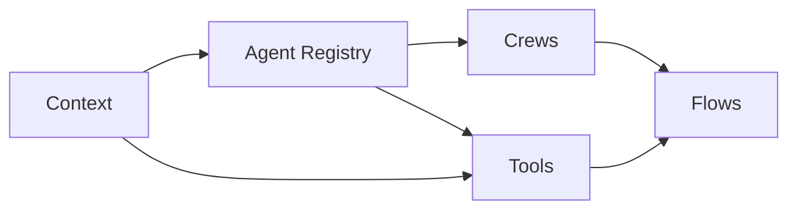

# Phase 2 Parallel Agent Tasks

This directory contains individual task files for Claude Code agents to execute Phase 2 of the remediation plan in parallel. Phase 2 focuses on architectural standardization to align with CrewAI best practices.

## Quick Start for Claude Code Agents

1. **Choose an agent role** from the available tasks below
2. **Read the coordination guide** to understand dependencies
3. **Open your task file** as primary instructions
4. **Begin work** following the timeline

## Available Agent Tasks

### Track A: Agent System (Foundation)
- [`AGENT_A1_AGENT_SYSTEM_CORE.md`](./AGENT_A1_AGENT_SYSTEM_CORE.md) - Build agent registry and convert to CrewAI patterns
- [`AGENT_A2_CREW_MANAGEMENT.md`](./AGENT_A2_CREW_MANAGEMENT.md) - Implement crew factory and management

### Track B: Flow Framework
- [`AGENT_B1_FLOW_FRAMEWORK.md`](./AGENT_B1_FLOW_FRAMEWORK.md) - Implement CrewAI Flows with @start/@listen decorators

### Track C: Context Management
- [`AGENT_C1_CONTEXT_MANAGEMENT.md`](./AGENT_C1_CONTEXT_MANAGEMENT.md) - Enhanced context injection and multi-tenancy

### Track D: Tool System
- [`AGENT_D1_TOOL_SYSTEM.md`](./AGENT_D1_TOOL_SYSTEM.md) - Tool registry and context-aware tools

### Coordination
- [`PHASE2_COORDINATION_GUIDE.md`](./PHASE2_COORDINATION_GUIDE.md) - How agents work together

## Phase 2 Overview

**Goal**: Transform the platform to use proper CrewAI patterns throughout

**Key Deliverables**:
1. All agents inherit from CrewAI Agent class
2. Flows use @start/@listen decorators
3. Context automatically propagates
4. Tools are context-aware
5. Crews orchestrate agent collaboration

## Timeline

### Week 3 (Days 11-15)
- **Days 11-12**: Foundation - registries and base classes
- **Days 13-14**: Core implementation
- **Day 15**: Initial integration

### Week 4 (Days 16-20)
- **Days 16-17**: Complete implementation
- **Days 18-19**: Integration testing
- **Day 20**: Final testing and merge

## Critical Dependencies



## For Human Coordinators

### Starting Agents

Create 5 Claude Code conversations with:

```
Please execute the Phase 2 remediation task defined in:
docs/planning/phase2-tasks/AGENT_[X]_[TASK].md

Follow the coordination guide at:
docs/planning/phase2-tasks/PHASE2_COORDINATION_GUIDE.md

Note: Phase 1 is complete. API v3 is ready, flow IDs are migrated, 
and PostgreSQL-only state management is implemented.
```

### Agent Capabilities

Each agent task is designed for a Claude Code agent with full codebase access. Agents will:
- Read existing code and understand patterns
- Create new files following CrewAI best practices
- Update existing components
- Test their changes
- Coordinate through PR comments

### Monitoring Progress

Track progress through:
1. PR creation and updates
2. Daily status in PR descriptions
3. Integration test results
4. Coordination guide checkpoints

## Success Criteria

### Technical Goals
- ✅ True CrewAI agents with proper inheritance
- ✅ Flows using decorators instead of manual orchestration
- ✅ Automatic context propagation via ContextVars
- ✅ Tools respecting tenant boundaries
- ✅ Crews managing agent collaboration

### Quality Metrics
- 85%+ test coverage
- All integration tests passing
- Performance targets met (<45s for 1000 records)
- Zero context leakage
- Clean architectural patterns

## Key Differences from Phase 1

### Phase 1 (Complete)
- Fixed immediate issues
- Consolidated APIs
- Migrated to flow IDs
- Cleaned up state management

### Phase 2 (Current)
- Architectural transformation
- Proper CrewAI patterns
- Enhanced context system
- Comprehensive tool framework
- Event-driven flows

## Important Notes

- **Dependencies**: Some agents can start immediately (C1), others need prerequisites
- **Integration**: Daily sync points ensure compatibility
- **Testing**: Each agent includes comprehensive tests
- **Documentation**: Update docs as you implement

## Ready to Transform! 🚀

The platform is ready for its architectural transformation. Each agent has clear tasks, the coordination is defined, and the path to proper CrewAI implementation is mapped out.

---

*Note: Ensure Phase 1 is fully complete before starting Phase 2 tasks.*