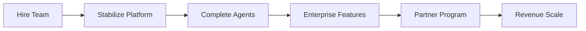

# AI Modernize Migration Platform - Immediate 6-Month Execution Plan

## Executive Summary
This 6-month plan addresses the critical gaps identified in our platform analysis, focusing on stabilizing operations, completing the agent suite, and achieving initial revenue targets. We maintain the successful CrewAI architecture while addressing the urgent single-developer risk.

---

## Month 1: Emergency Stabilization & Team Foundation
*Theme: Stop the Bleeding*

### Week 1-2: Critical Stabilization
- **Feature Freeze**: No new features, 100% focus on stability
- **Bug Triage**: Categorize and prioritize the 111+ production issues
- **Monitoring Setup**: Deploy Sentry/Datadog for error tracking
- **Documentation Sprint**: Record architecture videos, create runbooks

### Week 3-4: Immediate Hiring
- **Senior Backend Engineer**: Python/CrewAI expertise (urgent)
- **DevOps Engineer**: Docker/Kubernetes focus
- **Knowledge Transfer**: Daily pairing sessions with founder

**Success Metrics:**
- Bug fix rate: Reduce from 14/day to <5/day
- First hire onboarded
- Basic monitoring operational

---

## Month 2: Team Building & Agent Completion
*Theme: Build the Foundation*

### Week 5-6: Process Implementation
- **Sprint Structure**: First 2-week sprint with proper ceremonies
- **Code Review Process**: Mandatory PR reviews (use AI tools initially)
- **CI/CD Enhancement**: Automated testing gates

### Week 7-8: Core Agent Development
- **Execution Coordinator Agent**: Begin implementation
  - Integration with Master Flow Orchestrator
  - State management for running migrations
  - Rollback capabilities

**Success Metrics:**
- Team of 3 developers operational
- Sprint velocity established
- Bug fix ratio: <40%

---

## Month 3: Agent Suite Completion (Part 1)
*Theme: Core Functionality*

### Week 9-10: Execution Agent Completion
- Complete Execution Coordinator Agent
- Integration testing with existing flows
- Performance benchmarking

### Week 11-12: Containerization Agent
- Implement Containerization Specialist Agent
- Docker/K8s analysis capabilities
- Integration with discovery flows

**Success Metrics:**
- 15/17 agents operational
- First pilot customer deployment
- Bug fix ratio: <35%

---

## Month 4: Enterprise Features & Final Agents
*Theme: Market Readiness*

### Week 13-14: Enterprise Security
- **SSO Integration**: SAML 2.0 support
- **Audit Logging**: Immutable trail implementation
- **RBAC Enhancement**: Granular permissions

### Week 15-16: Complete Agent Suite
- **Decommission Coordinator Agent**
- **Cost Optimization (FinOps) Agent**
- Full integration testing

**Success Metrics:**
- All 17 agents operational
- 3 pilot customers active
- Initial revenue: $100K ARR

---

## Month 5: Performance & Partnership
*Theme: Scale Preparation*

### Week 17-18: Performance Optimization
- **Caching Layer**: Implement intelligent caching
- **Parallel Execution**: Optimize agent workflows
- **Database Optimization**: Query performance tuning

### Week 19-20: Partner Program
- **SI Partnership Framework**: Contracts and enablement
- **First SI Partner**: Sign and onboard
- **API Documentation**: Complete for partners

**Success Metrics:**
- 3x performance improvement
- First SI partner signed
- 5 paying customers

---

## Month 6: Revenue Acceleration
*Theme: Market Launch*

### Week 21-22: Go-to-Market Push
- **Pricing Launch**: Tiered model live
- **Sales Collateral**: Complete deck and demos
- **Reference Customers**: 2 case studies published

### Week 23-24: Scale Foundation
- **Team Expansion**: 5+ developers
- **Support Infrastructure**: Customer success processes
- **Q3 Planning**: Roadmap for scale

**Success Metrics:**
- $500K ARR achieved
- 10 customers signed
- Bug fix ratio: <25%

---

## Critical Path Dependencies

---

## Resource Requirements

### Immediate Hires (Month 1-2)
1. Senior Backend Engineer - $150K
2. DevOps Engineer - $140K
3. QA Engineer - $120K

### Additional Hires (Month 3-6)
4. Product Manager - $140K
5. Junior Developer - $100K
6. Customer Success Manager - $110K

### Infrastructure Costs
- Monitoring/Observability: $2K/month
- Cloud Infrastructure: $5K/month
- Development Tools: $1K/month

---

## Risk Mitigation

### Critical Risks
1. **Founder Dependency**
   - Daily knowledge transfer sessions
   - Comprehensive documentation
   - Shared on-call rotation by Month 2

2. **Technical Debt**
   - 20% sprint capacity for refactoring
   - Automated test requirements
   - Code quality gates

3. **Customer Churn**
   - Weekly customer check-ins
   - Rapid issue resolution
   - Success metrics tracking

---

## Success Criteria

### Technical Metrics
- **Uptime**: 99.5% (Month 3), 99.9% (Month 6)
- **Bug Fix Ratio**: 58% → 25%
- **Test Coverage**: 60% → 80%
- **Performance**: 3x improvement

### Business Metrics
- **ARR**: $0 → $500K
- **Customers**: 0 → 10
- **Team Size**: 1 → 6
- **NPS**: Establish baseline >30

### Operational Metrics
- **Sprint Predictability**: 80%+
- **MTTR**: <30 minutes
- **Documentation**: 100% coverage
- **Knowledge Distribution**: 3+ people know each system

---

## Weekly Execution Cadence

### Engineering
- Monday: Sprint planning/grooming
- Tuesday-Thursday: Development
- Friday: Demo, retro, planning

### Business
- Monday: Customer success sync
- Wednesday: Sales pipeline review
- Friday: Metrics review

### Leadership
- Weekly: Team 1:1s
- Bi-weekly: Board update
- Monthly: Strategic review

---

## Communication Plan

### Internal
- Daily standups (15 min)
- Weekly all-hands (30 min)
- Bi-weekly architecture review

### External
- Monthly customer advisory board
- Quarterly partner updates
- Regular PR/marketing pushes

---

## Conclusion

This 6-month plan transforms the AI Modernize Migration Platform from a single-developer project into a scalable, enterprise-ready solution. By addressing the critical team scaling need first, then systematically completing the agent suite and adding enterprise features, we create a foundation for sustainable growth while maintaining the innovative CrewAI architecture that differentiates us in the market.

The key to success is disciplined execution, focusing on stability before features, and building the team that can support our ambitious vision.