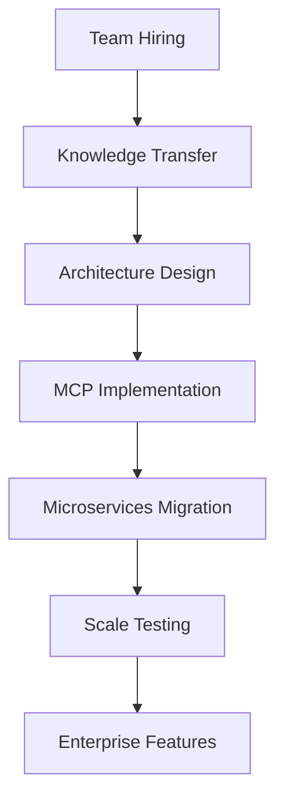
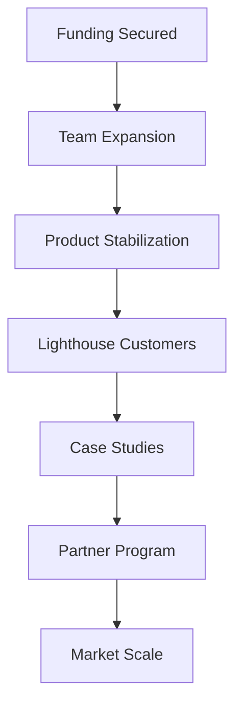

# AI Modernize Migration Platform - Quarterly Milestones & Dependencies

## Q1 2025: Foundation & Stabilization

### Key Themes
- **Risk Mitigation**: Address single developer dependency
- **Technical Debt**: Reduce bug rate from 58% to <20%
- **Team Building**: Scale from 1 to 6 team members

### Major Milestones

#### M1.1: Team Expansion (Week 1-4)
**Dependencies**: Budget approval, hiring pipeline
- [ ] Hire Senior Backend Engineer
- [ ] Hire DevOps/SRE Engineer
- [ ] Hire QA Automation Engineer
- [ ] Complete knowledge transfer program

#### M1.2: Platform Stabilization (Week 5-8)
**Dependencies**: Team onboarded, monitoring tools selected
- [ ] Implement comprehensive error handling
- [ ] Deploy APM monitoring solution
- [ ] Achieve 99.9% uptime SLA
- [ ] Reduce bug escape rate to <5%

#### M1.3: Testing Framework (Week 9-12)
**Dependencies**: QA engineer hired, test strategy defined
- [ ] 80% unit test coverage achieved
- [ ] Integration test suite complete
- [ ] Performance benchmarks established
- [ ] Automated regression testing live

### Success Criteria
- Team size: 6 people
- Test coverage: 80%
- Bug rate: <2 per week
- Customer pilots: 2 active
- Technical debt reduced by 40%

---

## Q2 2025: Architecture Evolution

### Key Themes
- **Microservices Migration**: Break down monolith
- **AI Enhancement**: Improve agent intelligence
- **Enterprise Features**: Build management console

### Major Milestones

#### M2.1: MCP Architecture (Week 1-6)
**Dependencies**: Architecture design complete, team trained on MCP
- [ ] 3 MCP servers deployed (Discovery, Assessment, Planning)
- [ ] Agent pooling implemented
- [ ] Service mesh operational
- [ ] API gateway live

#### M2.2: Intelligence Layer (Week 7-10)
**Dependencies**: Vector DB selected, ML engineer consulted
- [ ] Vector database deployed
- [ ] Intelligent LLM routing active
- [ ] Cost optimization achieving 50% savings
- [ ] Learning accuracy maintained at 95%+

#### M2.3: Enterprise Console (Week 11-12)
**Dependencies**: UI/UX design complete, frontend resources available
- [ ] Multi-tenant management UI
- [ ] RBAC fully implemented
- [ ] Audit logging complete
- [ ] Cost analytics dashboard live

### Success Criteria
- Microservices: 5 deployed
- System uptime: 99.9%
- Response time: <2s p95
- ARR: $500K
- 5 lighthouse customers active

---

## Q3 2025: Enterprise Readiness

### Key Themes
- **Security & Compliance**: SOC 2 certification
- **Integrations**: Enterprise tool connectivity
- **Market Entry**: Launch partner program

### Major Milestones

#### M3.1: Security Package (Week 1-6)
**Dependencies**: Security audit complete, compliance team engaged
- [ ] SOC 2 Type II audit initiated
- [ ] GDPR/CCPA compliance tools built
- [ ] Enterprise SSO implemented
- [ ] Data residency options available

#### M3.2: Integration Suite (Week 7-9)
**Dependencies**: Partner APIs documented, integration team hired
- [ ] ServiceNow connector live
- [ ] Jira integration complete
- [ ] Cloud provider native integrations
- [ ] Terraform provider published

#### M3.3: Partner Program (Week 10-12)
**Dependencies**: Partner contracts drafted, training materials ready
- [ ] 2 SI partners signed
- [ ] Partner portal launched
- [ ] Certification program active
- [ ] Co-sell agreements in place

### Success Criteria
- Enterprise customers: 10
- SI partners: 2 active
- Security certifications: In progress
- Integration partners: 5+
- ARR: $1.2M

---

## Q4 2025: Scale Preparation

### Key Themes
- **Performance**: Optimize for 10x scale
- **Self-Service**: Enable customer autonomy
- **Team Growth**: Expand to 15 people

### Major Milestones

#### M4.1: Performance Optimization (Week 1-6)
**Dependencies**: Load testing tools, performance engineer hired
- [ ] Edge caching implemented
- [ ] GPU acceleration for agents
- [ ] Batch processing optimized
- [ ] 10x scale capability proven

#### M4.2: Self-Service Platform (Week 7-10)
**Dependencies**: No-code framework selected, documentation complete
- [ ] No-code agent builder launched
- [ ] Visual workflow designer live
- [ ] Template marketplace active
- [ ] Community forum operational

#### M4.3: Sales Enablement (Week 11-12)
**Dependencies**: Sales team hired, CRM implemented
- [ ] Sales team fully ramped
- [ ] Demo environments automated
- [ ] Sales collateral complete
- [ ] Channel partnerships active

### Success Criteria
- Total customers: 25
- ARR: $2M
- Platform availability: 99.95%
- Team size: 15
- Agent executions: 1M+/month

---

## 2026 Outlook: Market Leadership

### Q1 2026: Ecosystem Platform
- Open-source agent framework
- Developer community launch
- Strategic acquisitions evaluated
- ARR: $5M

### Q2 2026: Global Expansion
- European operations launched
- Multi-language support
- Regional partnerships established
- ARR: $10M

### Q3 2026: AI Innovation
- Autonomous agent orchestration
- Predictive capabilities launched
- Industry solutions available
- ARR: $20M

### Q4 2026: Category Definition
- 100+ enterprise customers
- IPO readiness achieved
- Strategic exits evaluated
- ARR: $30M

---

## Critical Path Dependencies

### Technical Dependencies

### Business Dependencies

### Risk Mitigation Timeline
1. **Immediate** (Week 1-2): Hire first engineer
2. **Short-term** (Month 1): Complete knowledge transfer
3. **Medium-term** (Quarter 1): Stabilize platform
4. **Long-term** (Year 1): Achieve market fit

---

## Resource Requirements by Quarter

### Q1 2025
- **Headcount**: 6 FTEs
- **Budget**: $650K
- **Key Hires**: Backend, DevOps, QA
- **Infrastructure**: Basic monitoring

### Q2 2025
- **Headcount**: 8 FTEs
- **Budget**: $750K
- **Key Hires**: Frontend, ML Engineer
- **Infrastructure**: Kubernetes, Vector DB

### Q3 2025
- **Headcount**: 12 FTEs
- **Budget**: $900K
- **Key Hires**: Sales (2), Solutions Architect
- **Infrastructure**: Enterprise security tools

### Q4 2025
- **Headcount**: 15 FTEs
- **Budget**: $1.1M
- **Key Hires**: Sales (1), Marketing, Support
- **Infrastructure**: Global CDN, GPU cluster

---

## Quarterly Review Checkpoints

### End of Q1 2025
- [ ] Single developer risk eliminated
- [ ] Platform stability achieved
- [ ] Testing framework operational
- [ ] 2 customers in production

### End of Q2 2025
- [ ] Microservices architecture live
- [ ] Cost optimization proven
- [ ] Enterprise console launched
- [ ] 5 customers scaled

### End of Q3 2025
- [ ] Security certifications progressing
- [ ] Major integrations complete
- [ ] Partner ecosystem active
- [ ] 10 enterprise customers

### End of Q4 2025
- [ ] Platform scaled 10x
- [ ] Self-service capabilities live
- [ ] Sales engine operational
- [ ] $2M ARR achieved

Each milestone builds upon previous achievements, creating a sustainable path to market leadership while managing technical and business risks effectively.