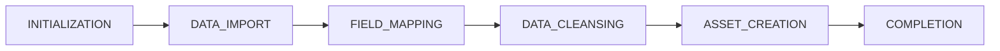
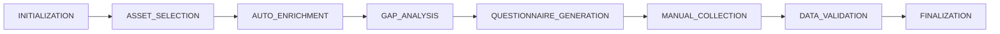
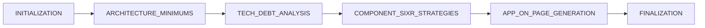

# Flow Architecture Guide for QA Testing

**Purpose**: Provide QA Playwright agent with architectural context to prevent random clicking and ensure accurate test execution.

**Target Audience**: qa-playwright-tester agent, QA engineers, developers writing E2E tests

---

## Application Overview

The Migration Orchestrator has **three main workflows** that MUST be executed in sequence:

```
Discovery Flow → Collection Flow → Assessment Flow → Planning Flow
(Import data) → (Fill gaps) → (Analyze/Recommend) → (Wave Planning)
```

### Workflow Dependencies

- **Collection Flow** requires completed **Discovery Flow** (needs assets to analyze)
- **Assessment Flow** requires completed **Collection Flow** (needs complete data)
- **Planning Flow** requires completed **Assessment Flow** (needs 6R recommendations)

⚠️ **CRITICAL**: Attempting to start a flow without its prerequisite will result in validation errors (this is NOT a bug, it's correct behavior).

---

## Discovery Flow

**Purpose**: Import existing infrastructure data and create asset inventory

### Phase Sequence (CANNOT BE SKIPPED)



### Phase 1: INITIALIZATION
**Entry Point**: `/discovery-flows` → "Create Discovery Flow" button

**UI State**:
- Form: Flow name input
- Dropdown: Automation tier selection
- Button: "Create Flow" (enabled)

**Expected Action**: Fill form and click "Create Flow"

**Success Indicator**: Redirects to flow detail page

---

### Phase 2: DATA_IMPORT
**UI State**:
- Upload area: "Drop CSV or click to upload"
- Button: "Upload" (disabled until file selected)
- Progress bar: Shows upload progress

**Expected Action**:
1. Select CSV file with CMDB data
2. Click "Upload"
3. **WAIT** for import to complete (5-30 seconds)

**Success Indicators**:
- Progress bar reaches 100%
- Message: "Import completed successfully"
- Asset count displayed (e.g., "127 rows imported")
- Phase status changes to "field_mapping"

**Common Mistakes**:
- ❌ Clicking "Continue" before import completes
- ❌ Uploading non-CSV files
- ❌ Not waiting for completion message

---

### Phase 3: FIELD_MAPPING
**UI State**:
- Mapping grid: Shows source → target field mappings
- Conflict indicators: Yellow/red badges for unmapped fields
- Button: "Approve Mappings" (appears when mapping complete)

**Expected Action**:
1. Review mapped fields (AI auto-maps most fields)
2. Resolve any conflicts (if red badges present)
3. Click "Approve Mappings"
4. **WAIT** for mapping confirmation (2-10 seconds)

**Success Indicators**:
- All fields mapped (no red badges)
- Message: "Field mappings approved"
- Phase status changes to "data_cleansing"

**Common Mistakes**:
- ❌ Approving mappings with unresolved conflicts
- ❌ Skipping mapping review
- ❌ Not waiting for confirmation

---

### Phase 4: DATA_CLEANSING
**UI State**:
- Progress indicator: "Cleansing data..."
- Statistics: Shows cleansing operations performed
- Log panel: Real-time cleansing activities

**Expected Action**: **WAIT** (automated phase, no user interaction)

**Duration**: 10-60 seconds depending on data volume

**Success Indicators**:
- Progress reaches 100%
- Message: "Data cleansing complete"
- Statistics: "X records cleansed, Y duplicates removed"
- Phase status changes to "asset_creation"

**Common Mistakes**:
- ❌ Trying to interact during automated processing
- ❌ Navigating away (will interrupt flow)

---

### Phase 5: ASSET_CREATION
**UI State**:
- Progress indicator: "Creating assets..."
- Asset count: Updates in real-time
- Preview: Shows sample assets being created

**Expected Action**: **WAIT** (automated phase, no user interaction)

**Duration**: 15-90 seconds depending on asset count

**Success Indicators**:
- Progress reaches 100%
- Message: "Assets created successfully"
- Asset count: "X assets created"
- Button: "View Assets" appears
- Phase status changes to "completion"

**Common Mistakes**:
- ❌ Not waiting for completion
- ❌ Missing "View Assets" button appearance

---

### Phase 6: COMPLETION
**UI State**:
- Status badge: Green "Completed"
- Button: "View Assets" (enabled)
- Button: "Start Collection Flow" (enabled)
- Summary: Flow statistics and timing

**Expected Action**:
- Option 1: Click "View Assets" to see inventory
- Option 2: Click "Start Collection Flow" to proceed

**Success Indicators**:
- Flow marked as "ready for collection"
- Assets visible in inventory page
- Collection flow can be created

---

## Collection Flow

**Purpose**: Gather missing data via automated enrichment and targeted questionnaires

**Prerequisites**:
- ✅ Discovery Flow COMPLETED
- ✅ At least 1 asset created

### Phase Sequence (CANNOT BE SKIPPED)



### Phase 1: INITIALIZATION
**Entry Point**: `/collection-flows` → "Create Collection Flow" button

**Prerequisites Check**:
- Discovery Flow must be "Completed"
- If no completed Discovery: Shows error "No discovery flows available"

**UI State**:
- Dropdown: Select discovery flow
- Form: Flow configuration
- Button: "Create Flow"

**Expected Action**: Select discovery flow and create

**Success Indicator**: Redirects to collection flow detail page

---

### Phase 2: ASSET_SELECTION
**UI State**:
- Asset grid: Shows all assets from discovery
- Checkboxes: Select assets for collection
- Button: "Continue" (enabled after selection)

**Expected Action**:
1. Select 1+ assets (checkboxes)
2. Click "Continue"

**Success Indicators**:
- Selection count updates
- "X assets selected" message
- Phase transitions to auto_enrichment

**Common Mistakes**:
- ❌ Not selecting any assets
- ❌ Selecting assets already 100% complete (no gaps)

---

### Phase 3: AUTO_ENRICHMENT
**UI State**:
- Progress: "Enriching asset data..."
- Statistics: "X fields enriched, Y data sources queried"

**Expected Action**: **WAIT** (automated phase)

**Duration**: 30-120 seconds

**Success Indicators**:
- Progress reaches 100%
- Message: "Auto-enrichment complete"
- Phase transitions to gap_analysis

---

### Phase 4: GAP_ANALYSIS
**UI State**:
- Progress: "Analyzing data gaps..."
- Gap count: Updates in real-time
- Priority distribution: Critical/High/Medium/Low

**Expected Action**: **WAIT** (automated phase)

**Duration**: 20-60 seconds

**Success Indicators**:
- Gap analysis complete
- Message: "X gaps identified"
- If gaps > 0: Transitions to questionnaire_generation
- If gaps == 0: Skips to finalization

---

### Phase 5: QUESTIONNAIRE_GENERATION
**UI State**:
- Progress: "Generating questionnaires..."
- AI activity log: Shows question generation
- Preview: Sample questions

**Expected Action**: **WAIT** (automated AI phase)

**Duration**: 10-60 seconds (AI generation time)

**Success Indicators**:
- Message: "X questionnaires generated"
- Questionnaires displayed in UI
- Phase transitions to manual_collection

**Common Mistakes**:
- ❌ Expecting instant generation (AI takes time)

---

### Phase 6: MANUAL_COLLECTION ⚠️ CRITICAL GATE

**UI State**:
- Questionnaires: Grouped by asset/category
- Form fields: Input fields for missing data
- Progress: "0/X questionnaires completed"
- Button: "Submit Responses" (disabled until at least 1 response)

**Expected Action**:
1. Fill out questionnaire sections
2. Click "Save" on each section
3. Click "Submit Responses" when done

**Success Indicators**:
- Response count updates: "X/Y completed"
- Progress bar increases
- Message: "Responses submitted successfully"
- Phase transitions to data_validation

**⚠️ CRITICAL VALIDATION** (Bug #1056-A Fix):
- **CANNOT** progress to finalization without responses
- If 0 responses: Returns status "awaiting_user_responses"
- This is NOT a bug - it's the completion gate working correctly

**Common Mistakes**:
- ❌ Clicking "Complete Collection" without filling questionnaires
- ❌ Expecting flow to complete with empty questionnaires
- ❌ Reporting "stuck in manual_collection" as bug (it's waiting for user input)

---

### Phase 7: DATA_VALIDATION ⚠️ CRITICAL GATE

**UI State**:
- Progress: "Validating collected data..."
- Gap closure: Shows before/after gap count
- Critical gaps: Highlighted in red if unresolved

**Expected Action**: **WAIT** (automated validation)

**Success Indicators**:
- All critical gaps (priority >= 80) resolved
- Message: "Data validation passed"
- Phase transitions to finalization

**⚠️ CRITICAL VALIDATION** (Bug #1056-B Fix):
- If critical gaps remain: Returns status "paused"
- User must provide more data
- This is NOT a bug - it's the validation gate working correctly

**Common Mistakes**:
- ❌ Reporting "paused for critical gaps" as bug (it's validation working)

---

### Phase 8: FINALIZATION ⚠️ CRITICAL GATE

**UI State**:
- Progress: "Finalizing collection..."
- Readiness checks: Shows all completion criteria
- Summary: Collection statistics

**Expected Action**: **WAIT** (automated finalization)

**⚠️ CRITICAL VALIDATION** (Bug #1056-C Fix):
**ALL these checks must pass**:
1. ✅ Questionnaires generated → responses collected
2. ✅ Critical gaps (priority >= 80) closed
3. ✅ Assessment readiness criteria met

**Success Indicators**:
- All checks pass (green checkmarks)
- Status changes to "COMPLETED"
- Button: "Start Assessment Flow" (enabled)

**⚠️ FAILURE SCENARIOS** (NOT bugs - working as designed):
- "incomplete_data_collection": Questionnaires exist but no responses
- "critical_gaps_remaining": Priority >= 80 gaps not closed
- These are INTENTIONAL blocks per Collection Flow completion gate fixes

**Common Mistakes**:
- ❌ Reporting finalization failures as bugs without checking completion criteria
- ❌ Expecting completion with empty questionnaires
- ❌ Not understanding the three validation gates (manual_collection, data_validation, finalization)

---

## Assessment Flow

**Purpose**: Analyze applications and recommend 6R migration strategies

**Prerequisites**:
- ✅ Collection Flow COMPLETED
- ✅ Assets have sufficient data quality

### Phase Sequence



### Phase 1: INITIALIZATION
**Entry Point**: `/assessment-flow` → "Create Assessment Flow"

**Prerequisites Check**:
- Collection Flow must be "Completed"
- Error if no completed Collections: "No collection flows available"

**UI State**:
- Dropdown: Select collection flow
- Application grid: Shows apps to assess
- Checkboxes: Select applications
- Button: "Create Assessment"

**Expected Action**: Select applications and create

---

### Phase 2: ARCHITECTURE_MINIMUMS
**UI State**:
- Form: Architecture requirements (cloud platform, security standards)
- Checkboxes: Architecture constraints
- Button: "Confirm Standards"

**Expected Action**: Review/set architecture standards

**Success Indicator**: Phase transitions to tech_debt_analysis

---

### Phase 3: TECH_DEBT_ANALYSIS
**UI State**:
- Progress: "Analyzing technical debt..."
- Metrics: Debt score by component

**Expected Action**: **WAIT** (automated AI analysis)

**Duration**: 60-180 seconds

**Success Indicator**: Analysis complete, transitions to sixr strategies

---

### Phase 4: COMPONENT_SIXR_STRATEGIES
**UI State**:
- Grid: Components with recommended strategies
- Badges: 6R strategy for each (Rehost/Refactor/Retain/etc.)
- AI reasoning: Explanation for recommendations

**Expected Action**: Review recommendations

**Success Indicator**: Phase transitions to app_on_page

---

### Phase 5: APP_ON_PAGE_GENERATION
**UI State**:
- Progress: "Generating assessment reports..."
- Preview: Sample "App on a Page" document

**Expected Action**: **WAIT** (automated report generation)

**Success Indicator**: Reports generated, flow marked complete

---

### Phase 6: FINALIZATION
**UI State**:
- Status: "Completed"
- Button: "View Assessments"
- Button: "Export Results"

**Expected Action**: View results or proceed to Planning Flow

---

## QA Testing Best Practices

### Before Testing Any Flow

1. **Check Prerequisites**
   - Discovery before Collection
   - Collection before Assessment
   - Collection must be COMPLETED (not just started)

2. **Understand Phase Sequence**
   - Phases execute in strict order
   - Cannot skip phases
   - Some phases are automated (just wait)

3. **Recognize Validation Gates**
   - Manual Collection: Needs responses
   - Data Validation: Needs critical gaps closed
   - Finalization: Needs all completion criteria

### During Testing

1. **Wait for Completion Indicators**
   - Progress bars reaching 100%
   - Success messages appearing
   - Status changes confirming transitions

2. **Don't Click Randomly**
   - Follow documented sequence
   - Check current phase first
   - Verify button should be enabled

3. **Distinguish Bugs from Validation**
   - "Cannot proceed without responses" → NOT a bug
   - "404 on valid URL" → BUG
   - "Stuck in processing" → Possibly BUG (unless waiting for AI)

### Reporting Issues

When reporting a potential bug, include:
- Current phase name
- Expected behavior (per this guide)
- Actual behavior
- Screenshot of UI state
- Whether you followed documented sequence

**Example Good Report**:
```
Phase: manual_collection
Expected: Should transition to data_validation after submitting responses
Actual: Still shows "awaiting_user_responses" after 5 minutes
Followed Sequence: Yes
Screenshot: [attached]
Conclusion: Possible bug - phase not transitioning despite responses
```

**Example Bad Report**:
```
Phase: finalization
Error: "incomplete_data_collection"
Conclusion: BUG - flow won't complete

ISSUE: Did not check if questionnaires had responses.
This is NOT a bug - it's Bug #1056-C fix working correctly!
```

---

## Common False Positives (NOT Bugs)

### ❌ "Collection won't complete with empty questionnaires"
**Status**: NOT a bug
**Reason**: Bug #1056-A fix - MUST have responses
**Reference**: PR #1058

### ❌ "Finalization blocked for critical gaps"
**Status**: NOT a bug
**Reason**: Bug #1056-B fix - MUST close critical gaps
**Reference**: PR #1058

### ❌ "Cannot start Collection without Discovery"
**Status**: NOT a bug
**Reason**: Prerequisite enforcement (architectural requirement)

### ❌ "Cannot start Assessment without Collection"
**Status**: NOT a bug
**Reason**: Prerequisite enforcement (architectural requirement)

### ❌ "Questionnaire generation takes 30+ seconds"
**Status**: NOT a bug
**Reason**: AI generation requires time (normal operation)

---

## Quick Reference: Expected Response Times

| Phase | Type | Duration | Max Acceptable |
|-------|------|----------|----------------|
| Data Import | I/O | 5-30s | 60s |
| Field Mapping | AI | 2-10s | 30s |
| Data Cleansing | Processing | 10-60s | 120s |
| Asset Creation | Database | 15-90s | 180s |
| Auto Enrichment | External API | 30-120s | 300s |
| Gap Analysis | AI | 20-60s | 120s |
| Questionnaire Gen | AI | 10-60s | 120s |
| Data Validation | Analysis | 5-30s | 60s |
| Tech Debt Analysis | AI | 60-180s | 300s |
| App on Page Gen | Report | 30-90s | 180s |

**If exceeds Max Acceptable**: Potential performance bug
**If within range**: Normal operation (wait for completion)

---

## Version History

- **v1.0** (2025-11-15): Initial guide created post-PR #1058
- Includes Collection Flow completion gate fixes (Bugs #1055, #1056-A/B/C)
- Documents proper test sequences to prevent false positives

---

**Last Updated**: 2025-11-15
**Related Issues**: #1061 (QA agent architectural context)
**Related PRs**: #1058 (Collection Flow completion gates)
