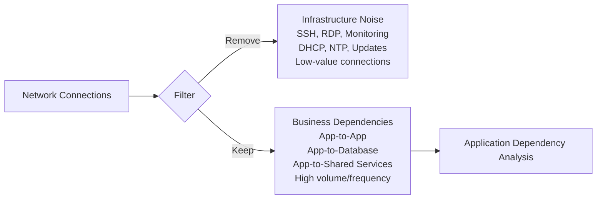
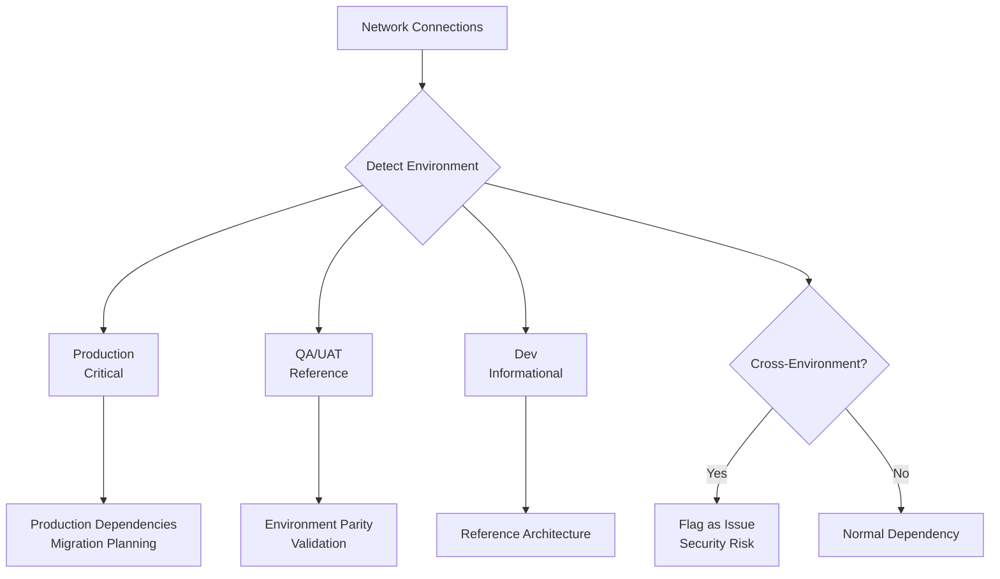
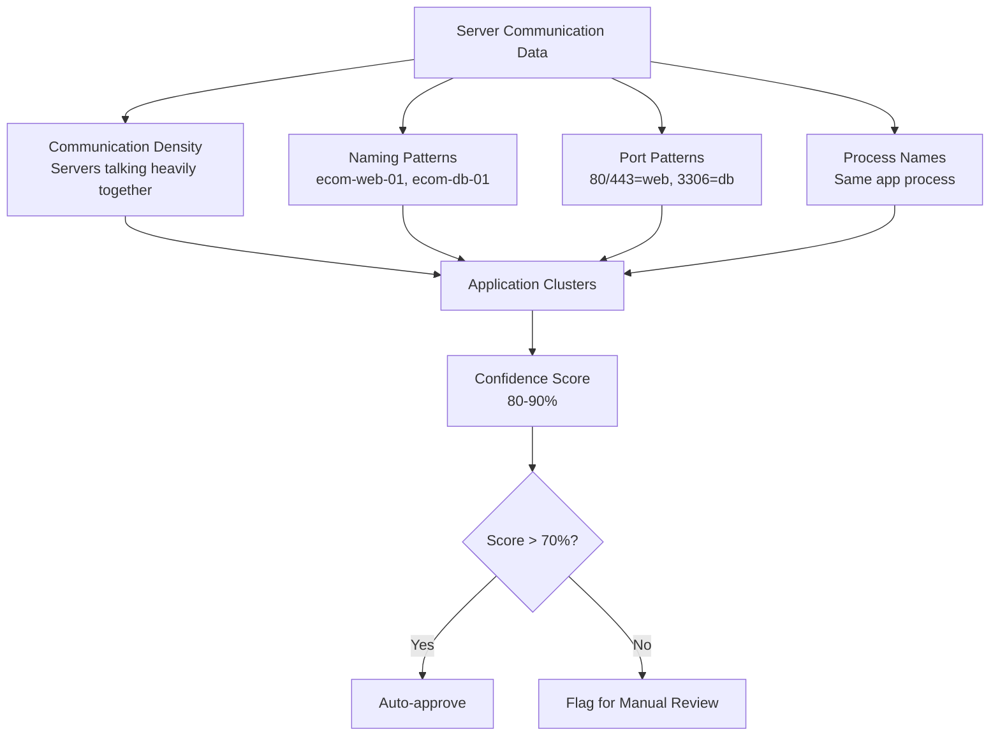
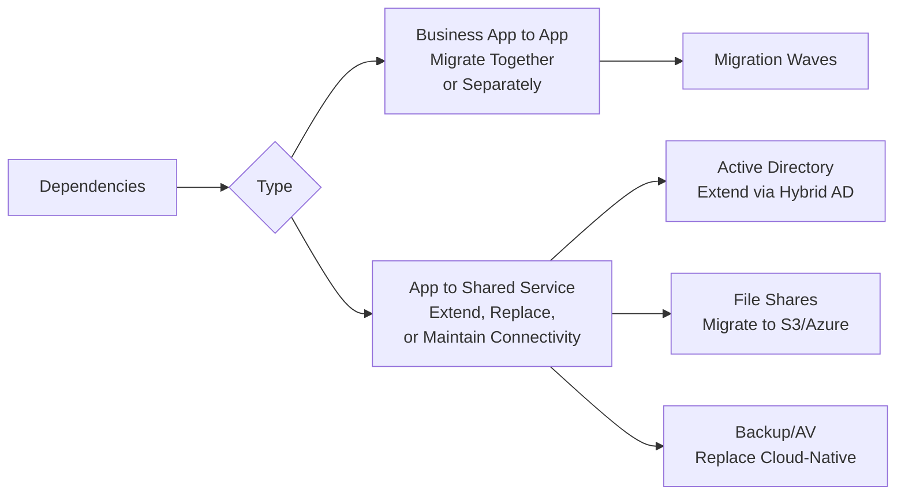
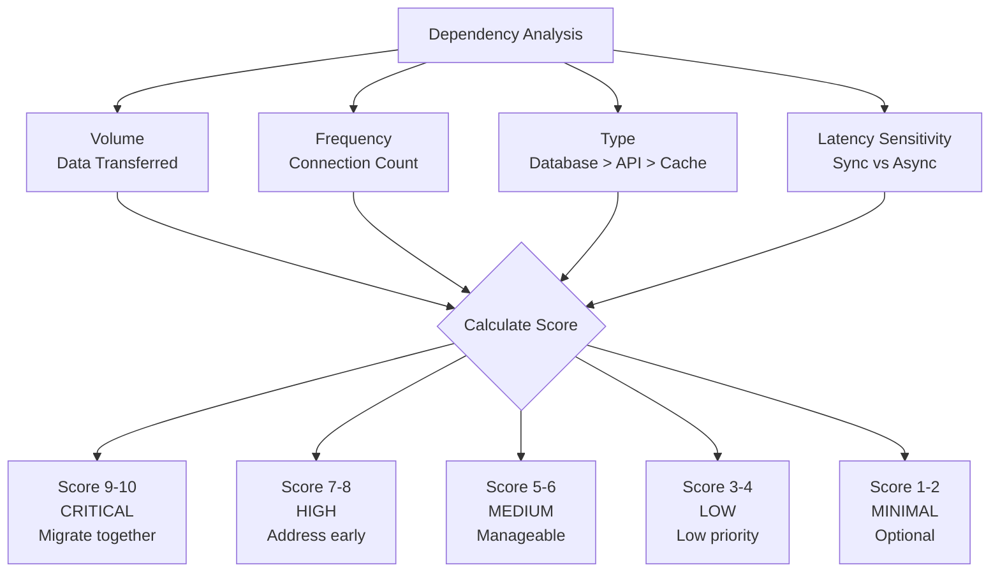
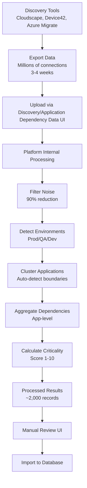
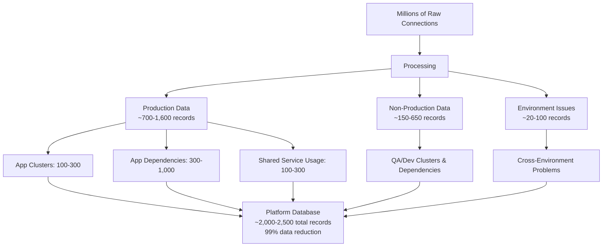
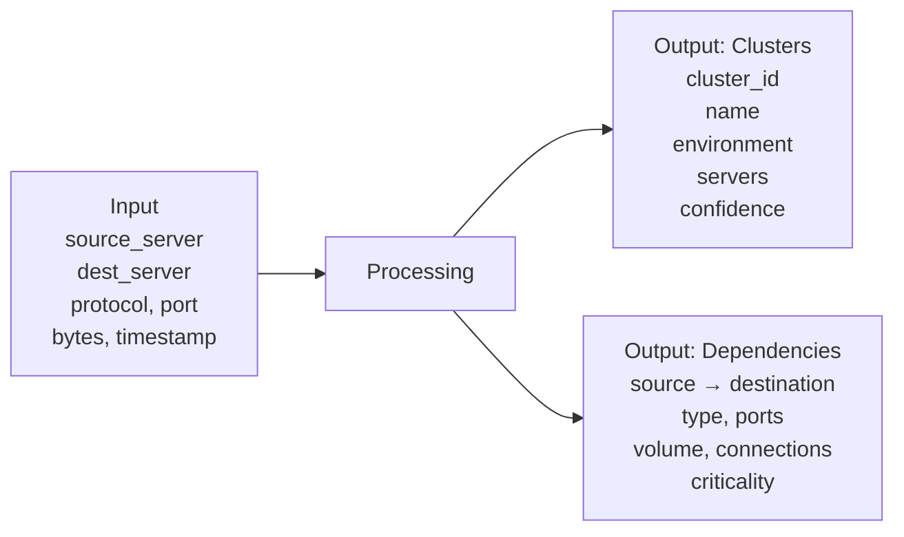

# **Business Requirements: Non-CMDB Data Ingestion**

## **Executive Summary**

**Business Need:** Import network communication data from discovery tools (Cloudscape, Device42, Azure Migrate) to understand real application dependencies for migration planning.

**Problem:** CMDB has application-to-server mappings, but they're often outdated or inaccurate. Network discovery tools show actual runtime dependencies.

**Solution:** Upload raw network connection records to AIForce-Assess platform, process internally to extract actionable application-level dependencies.

---

## **Why Non-CMDB Data?**

### **CMDB Limitations**
- ❌ App-to-server mappings exist but often outdated
- ❌ Dependencies documented manually (if at all)
- ❌ No visibility into actual runtime behavior
- ❌ Missing protocol, volume, frequency details

### **Discovery Tools Provide**
- ✅ Actual communication patterns observed over 3-4 weeks
- ✅ Source → Destination with protocol, port, process details
- ✅ Volume and frequency indicating criticality
- ✅ Hidden dependencies never documented in CMDB

---

## **Core Requirements**

### **1. Support Multiple Discovery Tools**

**Supported Tools:**
- Cloudscape
- Device42
- Azure Migrate
- AWS Migration Hub
- NetFlow/sFlow

**Data Formats:** CSV, JSON, APIs  
**Data Volume:** Millions of network connection records per environment

---

### **2. Aggressive Noise Filtering**
**Goal:** 90% noise reduction - eliminate data not required for app dependency analysis

#### **Filter Out:**
- **Management traffic:** SSH, RDP, WinRM
- **Monitoring:** Health checks, SNMP
- **Infrastructure:** DHCP, NTP, DNS lookups
- **Internal replication:** Database HA, storage sync
- **OS maintenance:** Windows Update, patching
- **Low-value:** Less than 100 connections over observation period

#### **Keep Only:**
- ✅ Application-to-application communications
- ✅ Application-to-database/cache/message queue
- ✅ Application-to-shared services (Active Directory, file shares)
- ✅ High-volume or high-frequency connections

#### **Filtering Decision Logic:**



---

### **3. Environment Awareness**

| Environment | Priority | Treatment |
|-------------|----------|-----------|
| **Production** | Critical | Primary migration planning focus |
| **QA/UAT/Dev** | Reference | Typically rebuilt, not migrated |
| **Cross-Environment** | Issue | Flag as security risk - fix before migration |

#### **Environment Detection Logic:**



---

### **4. Application Clustering**

**Auto-detect application boundaries using:**
- **Communication density:** Servers talking heavily = same app
- **Naming patterns:** `ecommerce-web-01`, `ecommerce-db-01` = E-commerce app
- **Port patterns:** 80/443 = web tier, 3306 = database tier
- **Process names:** Same Java app running = application cluster

**Output:** Application groupings with 80-90% confidence, flagged for manual review

#### **Clustering Logic Diagram:**



---

### **5. Shared Service Separation**

#### **Business Applications** (migrate):
- E-commerce Web → Payment Service
- CRM → Database

#### **Shared Services** (extend/replace):
- Any App → **Active Directory:** Extend via hybrid AD
- Any App → **File Shares:** Migrate to S3/Azure Files or maintain connectivity
- Any App → **Backup/AV:** Replace with cloud-native

**Note:** Different migration strategies for each type.

#### **Dependency Type Classification:**



---

### **6. Dependency Context**

Capture **how** applications communicate:

| Communication Type | Example | Migration Impact |
|-------------------|---------|------------------|
| **Database** | TCP 3306, java.exe → mysqld | Latency-sensitive, critical |
| **File Share** | SMB 445 | Migrate to cloud storage or VPN |
| **Cache** | TCP 6379 | Replace with cloud cache, low risk |

---

### **7. Criticality Scoring** (1-10)

**Based on:**
- Volume (data transferred)
- Frequency (connection count)
- Type (database > API > cache)
- Latency sensitivity

#### **Score Interpretation:**
| Score | Priority | Action |
|-------|----------|--------|
| **9-10** | Critical | Must migrate together |
| **7-8** | High | Important, address early |
| **5-6** | Medium | Manageable |
| **3-4** | Low | Low priority |
| **1-2** | Minimal | Optional |

#### **Criticality Scoring Logic:**



---

### **8. Manual Review Interface**

**Users can:**
- ✏️ Review auto-detected clusters
- ✂️ Split/merge/rename applications
- 🎚️ Override criticality scores
- 📝 Add business context
- ✅ Approve final results

---

## **Data Ingestion Process**

### **Process Steps:**

```
Discovery Tool Export (millions of connections)
    ↓
Upload to Platform (via Discovery/Application Dependency Data UI)
    ↓
Platform Internal Processing
    ├─ Filter noise (90% reduction - infrastructure traffic)
    ├─ Detect environments (prod/qa/dev)
    ├─ Cluster servers into applications
    ├─ Aggregate to app-level dependencies
    └─ Calculate criticality scores
    ↓
Processed Results (~2,000-2,500 records)
    ↓
Manual Review & Refinement (UI)
    ↓
Import into Database
```

#### **Overall Data Ingestion Process Diagram:**



### **Ingestion Method:**

**File Upload Workflow:**
1. Customer exports raw data from discovery tool (CSV/JSON)
2. Customer uploads file via **Discovery/Application Dependency Data** UI in AIForce-Assess
3. Platform processes data internally (9-stage pipeline)
4. Platform displays processed results for review
5. User reviews and refines results (split/merge clusters, adjust scores)
6. User approves and imports into database

**Future Enhancement:** Direct API integration with discovery tools for automated imports

---

## **What Gets Imported**

### **Production Environment (Critical):**
- **Application Clusters:** 100-300 clusters
- **Application Dependencies:** 300-1,000 dependency relationships
- **Shared Service Usage:** 100-300 service connections

### **Non-Production Environments (Reference):**
- **QA/Dev Clusters & Dependencies:** 150-650 relationships

### **Issues Identified:**
- **Cross-Environment Problems:** 20-100 flagged issues

### **Total Records: ~2,000-2,500** (vs millions raw)

**Data Reduction: 99%** while retaining all business-critical insights

#### **Import Data Breakdown:**



---

## **Data Schema Requirements**

### **Input Data Fields** (from discovery tools):

**Required Fields:**
- source_server
- destination_server
- protocol
- port
- bytes_transferred
- timestamp

**Optional Fields:**
- source_process
- destination_process
- connection_duration
- latency_ms

### **Output Data Structure** (to platform):

#### **Application Cluster Record:**
- Unique cluster identifier
- Cluster name (business-friendly)
- Environment classification (prod/qa/dev)
- List of servers in cluster
- Confidence score (0.0 to 1.0)
- Auto-detected or manually created flag

#### **Dependency Record:**
- Source application/cluster
- Destination application/cluster
- Communication type (api_call, database, file_share, cache)
- Ports used
- Volume (GB transferred)
- Connection count
- Criticality score (1-10)
- Protocol details
- Average latency

#### **Shared Service Record:**
- Service name (Active Directory, File Share, etc.)
- Service type classification
- Applications using the service
- Connection frequency
- Migration recommendation (extend/replace/maintain)

#### **Data Transformation Pipeline:**



---

## **Business Value**

**Transformation:**
- **From:** Millions of network connections (unusable for planning)
- **To:** Actionable application dependency map

### **Key Benefits:**

1. ✅ **Identify Dependencies:** Understand which apps depend on each other
2. ✅ **Assess Criticality:** Know which dependencies are mission-critical
3. ✅ **Plan Migration Waves:** Group tightly coupled apps for migration together
4. ✅ **Early Risk Assessment:** Identify migration risks before execution
5. ✅ **Discover Hidden Dependencies:** Find undocumented relationships
6. ✅ **Shared Service Planning:** Understand infrastructure requirements
7. ✅ **Environment Hygiene:** Fix cross-environment issues before migration

### **Cost Savings:**
- Reduce migration delays by 30-40% (better planning)
- Avoid post-migration issues (dependency breaks)
- Optimize migration waves (fewer iterations)
- Reduce manual discovery effort by 80%

---

**Document Version:** 1.0  
**Last Updated:** 2025-10-20  
**Owner:** Enterprise Architecture Team  
**Status:** Proposed for Implementation  

---

