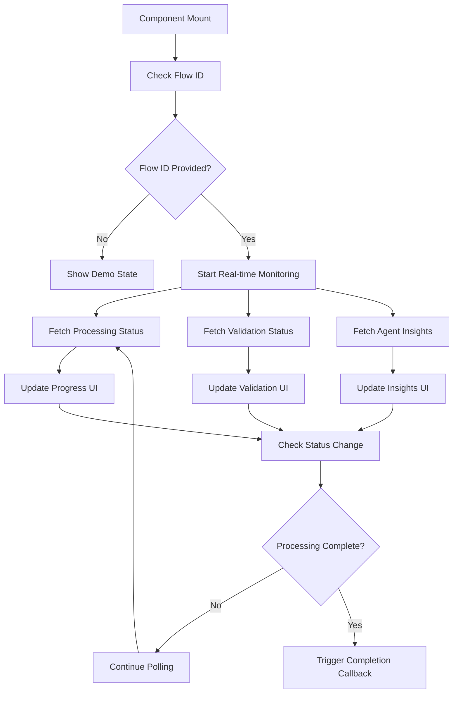

# Universal Processing Status Component

## Overview

The `UniversalProcessingStatus` component is a comprehensive, reusable React component that provides real-time updates for any processing operation in the AI Stock Assess Platform. It replaces static "Upload & Validation Status" sections with live, interactive monitoring of agentic backend processes.

## Key Features

### 🔄 Real-Time Updates
- Live progress tracking with dynamic polling
- Agent status monitoring with confidence scores
- Processing phase transitions with estimated completion times
- Record-level processing status (processed/failed/total)

### 🛡️ Security & Validation
- Real-time security scanning feedback
- Format validation with error reporting
- Data quality assessment with scoring
- Issue detection and alerting

### 🤖 Agent Intelligence Integration
- Live agent insights with streaming updates
- Agent clarifications and questions
- Confidence scoring and performance metrics
- Integration with existing Agent-UI-Monitor components

### 🎨 Flexible UI
- Compact and full-size display modes
- Expandable sections for detailed information
- Customizable titles and contexts
- Responsive design for all screen sizes

## Usage

### Basic Integration

```tsx
import UniversalProcessingStatus from '@/components/discovery/UniversalProcessingStatus';

// Basic usage with flow ID
<UniversalProcessingStatus
  flow_id="your-flow-id-here"
  page_context="data_import"
  title="Upload & Validation Status"
/>
```

### Advanced Integration

```tsx
<UniversalProcessingStatus
  flow_id={currentFlowId}
  page_context="attribute_mapping"
  title="Field Mapping Progress"
  compact={false}
  showAgentInsights={true}
  showValidationDetails={true}
  onProcessingComplete={() => {
    // Handle completion - navigate to next phase, show success message, etc.
    console.log('Processing completed successfully!');
    navigateToNextPhase();
  }}
  onValidationFailed={(issues) => {
    // Handle validation failures - show errors, pause processing, etc.
    console.error('Validation issues found:', issues);
    showValidationErrors(issues);
  }}
/>
```

### Demo Mode (No Flow ID)

```tsx
// Shows placeholder state when no active processing
<UniversalProcessingStatus
  page_context="data_import"
  title="Upload & Validation Status"
  showAgentInsights={true}
  showValidationDetails={true}
/>
```

## Props

| Prop | Type | Default | Description |
|------|------|---------|-------------|
| `flow_id` | `string?` | `undefined` | Flow ID for real-time monitoring. If not provided, shows demo/placeholder state |
| `page_context` | `string` | `'data_import'` | Page context for filtering insights and updates |
| `title` | `string` | `'Upload & Validation Status'` | Component title displayed in header |
| `className` | `string` | `''` | Additional CSS classes for styling |
| `compact` | `boolean` | `false` | Compact display mode with reduced information |
| `showAgentInsights` | `boolean` | `true` | Show/hide agent insights section |
| `showValidationDetails` | `boolean` | `true` | Show/hide validation details section |
| `onProcessingComplete` | `() => void` | `undefined` | Callback when processing completes successfully |
| `onValidationFailed` | `(issues: string[]) => void` | `undefined` | Callback when validation issues are detected |

## Page Context Options

The `page_context` prop determines which insights and updates are shown:

- `data_import` - Data upload and validation phase
- `attribute_mapping` - Field mapping and transformation phase
- `data_cleansing` - Data quality improvement phase
- `asset_inventory` - Asset discovery and classification phase
- `dependency_analysis` - Relationship mapping phase
- `tech_debt_analysis` - Technical debt assessment phase
- `sixr_analysis` - 6R migration strategy analysis

## Integration Examples

### Data Import Page

```tsx
const DataImportPage = () => {
  const [currentFlow, setCurrentFlow] = useState<string | null>(null);

  const handleFileUpload = async (file: File) => {
    const flowResponse = await startDataImportFlow(file);
    setCurrentFlow(flowResponse.flow_id);
  };

  return (
    <div className="grid grid-cols-1 lg:grid-cols-3 gap-6">
      <div className="lg:col-span-2">
        {/* File upload UI */}
        <FileUploadComponent onUpload={handleFileUpload} />
      </div>

      <div>
        {/* Real-time processing status */}
        <UniversalProcessingStatus
          flow_id={currentFlow}
          page_context="data_import"
          title="Upload & Validation Status"
          onProcessingComplete={() => {
            // Navigate to next phase
            router.push('/discovery/attribute-mapping');
          }}
          onValidationFailed={(issues) => {
            // Show validation errors
            toast.error(`Validation failed: ${issues.join(', ')}`);
          }}
        />
      </div>
    </div>
  );
};
```

### Attribute Mapping Page

```tsx
const AttributeMappingPage = () => {
  const { flow_id } = useParams();

  return (
    <div className="space-y-6">
      {/* Mapping interface */}
      <FieldMappingInterface flow_id={flow_id} />

      {/* Real-time processing status */}
      <UniversalProcessingStatus
        flow_id={flow_id}
        page_context="attribute_mapping"
        title="Field Mapping Progress"
        compact={true}
        onProcessingComplete={() => {
          // Refresh mapping results
          refetchMappings();
        }}
      />
    </div>
  );
};
```

### Dashboard Overview

```tsx
const DashboardPage = () => {
  const { activeFlows } = useActiveFlows();

  return (
    <div className="grid grid-cols-1 md:grid-cols-2 lg:grid-cols-3 gap-6">
      {activeFlows.map((flow) => (
        <UniversalProcessingStatus
          key={flow.id}
          flow_id={flow.id}
          page_context={flow.current_phase}
          title={`${flow.name} - ${flow.current_phase}`}
          compact={true}
          className="h-fit"
        />
      ))}
    </div>
  );
};
```

## Backend Integration

The component relies on these backend endpoints:

### Required Endpoints
- `GET /api/v1/flows/{flow_id}/processing-status` - Real-time processing status
- `GET /api/v1/flows/{flow_id}/validation-status` - Validation results
- `GET /api/v1/flows/{flow_id}/agent-insights` - Agent insights and updates

### Optional Endpoints
- `POST /api/v1/flows/{flow_id}/validate` - Manual validation trigger
- `POST /api/v1/flows/{flow_id}/retry` - Retry failed processing
- `POST /api/v1/flows/{flow_id}/pause` - Pause processing
- `POST /api/v1/flows/{flow_id}/resume` - Resume processing

## Real-Time Data Flow



## Styling and Theming

The component uses Tailwind CSS classes and can be customized:

```tsx
// Custom styling
<UniversalProcessingStatus
  flow_id={flowId}
  className="border-2 border-blue-500 bg-blue-50"
  title="Custom Processing Monitor"
/>
```

### CSS Variables for Theming

```css
:root {
  --processing-primary: #3b82f6;
  --processing-success: #10b981;
  --processing-warning: #f59e0b;
  --processing-error: #ef4444;
  --processing-background: #f8fafc;
}
```

## Performance Considerations

### Polling Strategy
- **Active Processing**: 2-second intervals
- **Idle State**: 10-second intervals
- **Completed**: Stops polling automatically
- **Error State**: 5-second intervals with exponential backoff

### Memory Management
- Automatic cleanup on component unmount
- Debounced API calls to prevent excessive requests
- Efficient state updates to minimize re-renders

### Optimization Tips

```tsx
// Use React.memo for performance
const OptimizedProcessingStatus = React.memo(UniversalProcessingStatus);

// Memoize callback functions
const handleCompletion = useCallback(() => {
  // Handle completion
}, [dependencies]);

<OptimizedProcessingStatus
  flow_id={flowId}
  onProcessingComplete={handleCompletion}
/>
```

## Error Handling

The component includes comprehensive error handling:

- **Network Errors**: Automatic retry with exponential backoff
- **API Errors**: Graceful degradation with error messages
- **Invalid Data**: Safe rendering with fallback values
- **Component Errors**: Error boundary integration

```tsx
import { ErrorBoundary } from 'react-error-boundary';

<ErrorBoundary fallback={<ProcessingErrorFallback />}>
  <UniversalProcessingStatus flow_id={flowId} />
</ErrorBoundary>
```

## Testing

### Unit Tests

```tsx
import { render, screen } from '@testing-library/react';
import UniversalProcessingStatus from './UniversalProcessingStatus';

test('shows demo state when no flow_id provided', () => {
  render(<UniversalProcessingStatus />);
  expect(screen.getByText('No Active Processing')).toBeInTheDocument();
});

test('shows processing status when flow_id provided', () => {
  render(<UniversalProcessingStatus flow_id="test-flow" />);
  expect(screen.getByText('Loading processing status...')).toBeInTheDocument();
});
```

### Integration Tests

```tsx
test('calls onProcessingComplete when status changes to completed', async () => {
  const mockCallback = jest.fn();

  render(
    <UniversalProcessingStatus
      flow_id="test-flow"
      onProcessingComplete={mockCallback}
    />
  );

  // Mock API response with completed status
  // ... test implementation

  await waitFor(() => {
    expect(mockCallback).toHaveBeenCalledTimes(1);
  });
});
```

## Migration Guide

### Replacing Static Status Sections

**Before:**
```tsx
// Static status section
<div className="status-section">
  <h3>Upload & Validation Status</h3>
  <div className="progress-bar">
    <div className="progress" style={{ width: '0%' }}></div>
  </div>
  <p>Processing...</p>
</div>
```

**After:**
```tsx
// Dynamic real-time status
<UniversalProcessingStatus
  flow_id={currentFlowId}
  page_context="data_import"
  title="Upload & Validation Status"
  onProcessingComplete={() => navigateToNext()}
/>
```

### Updating Existing Pages

1. **Import the component**
   ```tsx
   import UniversalProcessingStatus from '@/components/discovery/UniversalProcessingStatus';
   ```

2. **Replace static sections**
   ```tsx
   // Replace existing status divs with UniversalProcessingStatus
   ```

3. **Add flow state management**
   ```tsx
   const [currentFlow, setCurrentFlow] = useState<string | null>(null);
   ```

4. **Connect to processing callbacks**
   ```tsx
   const handleProcessingComplete = () => {
     // Your completion logic
   };
   ```

## Troubleshooting

### Common Issues

**Component shows "Loading..." indefinitely**
- Check if backend endpoints are available
- Verify flow_id is valid and exists in database
- Check network connectivity and CORS settings

**Real-time updates not working**
- Verify polling is enabled (not paused due to errors)
- Check browser console for API errors
- Ensure agent-UI bridge is properly configured

**Performance issues with multiple components**
- Use `compact={true}` for dashboard views
- Implement React.memo for optimization
- Consider virtualization for large lists

### Debug Mode

```tsx
// Enable debug logging
<UniversalProcessingStatus
  flow_id={flowId}
  debug={true} // Enables console logging
/>
```

## Contributing

When contributing to the Universal Processing Status component:

1. **Follow the modular pattern** - Keep processing logic separate from UI
2. **Maintain backward compatibility** - Don't break existing integrations
3. **Add comprehensive tests** - Unit and integration tests required
4. **Update documentation** - Keep this README current
5. **Performance first** - Consider impact on polling and re-renders

## Support

For issues with the Universal Processing Status component:

1. Check this documentation first
2. Review the component source code
3. Check backend API endpoint availability
4. File an issue with reproduction steps
