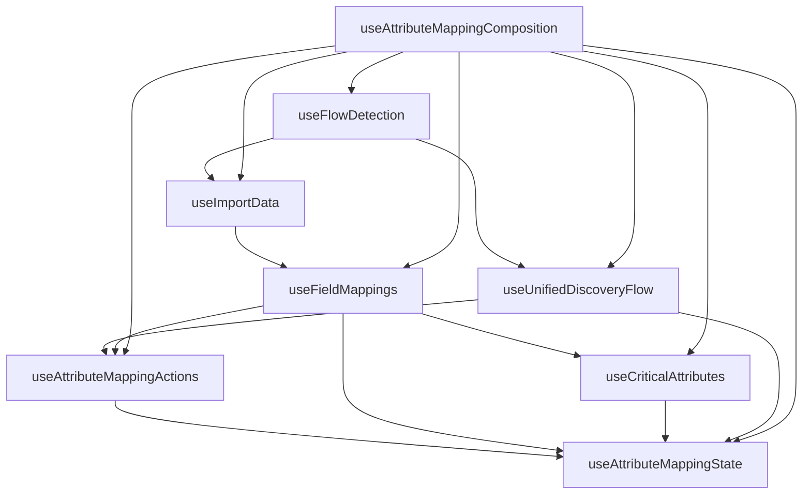

# Attribute Mapping Hooks - Modular Architecture

This directory contains the modular refactored version of the attribute mapping logic, previously contained in a single 1,098-line file.

## Architecture Overview

The original `useAttributeMappingLogic.ts` has been split into 6 specialized hooks plus a main composition hook:

### 🎯 Specialized Hooks

1. **`useFlowDetection`** - Flow detection and routing
   - URL parsing and route parameter extraction
   - Auto-detection logic for flow_id and session_id
   - Navigation and routing integration
   - Context determination logic

2. **`useFieldMappings`** - Field mappings data management
   - Field mappings CRUD operations
   - Data fetching with React Query
   - Target field data management
   - Mapping validation and state

3. **`useImportData`** - Import data handling
   - Import data fetching and management
   - Data transformation and processing
   - Error handling for import operations
   - Cache management for import data

4. **`useCriticalAttributes`** - Critical attributes calculation
   - Critical attributes calculation and logic
   - Data analysis and scoring
   - Business rules for attribute importance
   - Summary statistics generation

5. **`useAttributeMappingActions`** - User actions and workflow
   - User action handlers (approve, reject, etc.)
   - Bulk operations and batch processing
   - Workflow state transitions
   - Action validation and confirmation

6. **`useAttributeMappingState`** - Centralized state management
   - Centralized state management
   - Progress tracking and status updates
   - Loading states and error handling
   - State synchronization between hooks

### 🔧 Composition Hook

**`useAttributeMappingComposition`** - Main composition hook that:
- Combines all specialized hooks
- Manages hook dependencies and data flow
- Provides the same API as the original hook
- Maintains backward compatibility

## Usage

### Import the Main Hook (Recommended)

```typescript
import { useAttributeMappingLogic } from './hooks/discovery/attribute-mapping';

// Usage in component
const {
  fieldMappings,
  criticalAttributes,
  mappingProgress,
  handleApproveMapping,
  handleMappingChange,
  // ... all other properties
} = useAttributeMappingLogic();
```

### Import Specialized Hooks (Advanced)

```typescript
import {
  useFlowDetection,
  useFieldMappings,
  useImportData,
  useCriticalAttributes,
  useAttributeMappingActions,
  useAttributeMappingState
} from './hooks/discovery/attribute-mapping';

// Use individual hooks for specific functionality
const { finalFlowId } = useFlowDetection();
const { fieldMappings } = useFieldMappings(importData, fieldMappingData);
const { criticalAttributes } = useCriticalAttributes(finalFlowId, realFieldMappings, fieldMappings, fieldMappingData);
```

## Benefits of Modular Architecture

### 🧩 Separation of Concerns
- Each hook has a single, well-defined responsibility
- Easier to understand and maintain individual pieces
- Cleaner code organization

### 🔄 Reusability
- Specialized hooks can be reused in other contexts
- Mix and match hooks for different use cases
- Better code reuse across the application

### 🧪 Testability
- Individual hooks can be tested in isolation
- Easier to write unit tests for specific functionality
- Better test coverage and reliability

### 📈 Performance
- Only re-render when specific hook data changes
- Better React Query caching strategies
- Optimized data fetching patterns

### 🛠️ Maintainability
- Easier to debug specific functionality
- Cleaner git diffs and code reviews
- Better developer experience

## Migration Guide

### For Existing Components

The main hook maintains the same API, so existing components should work without changes:

```typescript
// Before (still works)
import { useAttributeMappingLogic } from '../hooks/discovery/useAttributeMappingLogic';

// After (new modular version)
import { useAttributeMappingLogic } from '../hooks/discovery/attribute-mapping';
```

### For New Components

Use the specialized hooks directly when you only need specific functionality:

```typescript
// Only need flow detection
import { useFlowDetection } from '../hooks/discovery/attribute-mapping';

// Only need field mappings
import { useFieldMappings } from '../hooks/discovery/attribute-mapping';

// Only need actions
import { useAttributeMappingActions } from '../hooks/discovery/attribute-mapping';
```

## TypeScript Support

All hooks are fully typed with TypeScript:

```typescript
import type {
  FlowDetectionResult,
  FieldMappingsResult,
  CriticalAttributesResult,
  AttributeMappingActionsResult,
  AttributeMappingStateResult
} from './hooks/discovery/attribute-mapping';
```

## Hook Dependencies



## Error Handling

Each hook handles its own errors and provides error states:

```typescript
const {
  fieldMappingsError,
  importDataError,
  criticalAttributesError,
  flowStateError
} = useAttributeMappingLogic();
```

## React Query Integration

All hooks use React Query for data fetching with:
- Proper caching strategies
- Error handling and retry logic
- Loading states
- Data synchronization

## Performance Optimizations

- **Selective re-renders**: Only hooks with changed data re-render
- **Optimized queries**: React Query caching reduces API calls
- **Lazy loading**: Data is fetched only when needed
- **Memory management**: Proper cleanup and garbage collection

## Future Enhancements

- Add more granular hooks for specific UI components
- Implement optimistic updates for better UX
- Add real-time synchronization with WebSockets
- Implement advanced caching strategies
- Add comprehensive error boundary integration
